**전체 usecase**

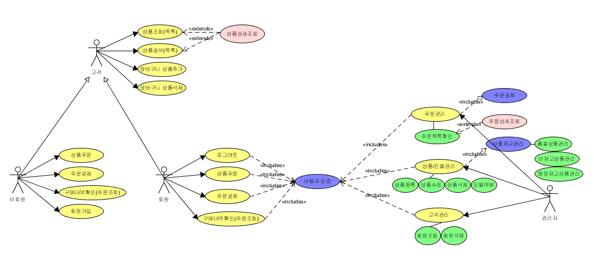

**고객 usecases**

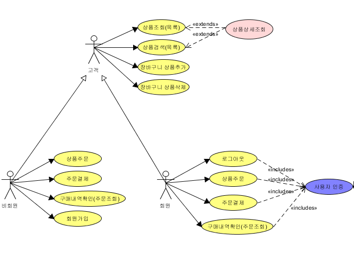

[TOC]

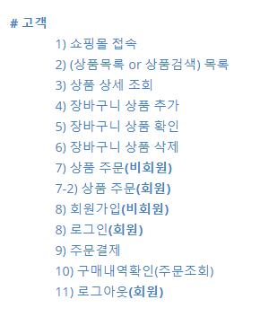

# # 고객

### 1) 쇼핑몰 접속

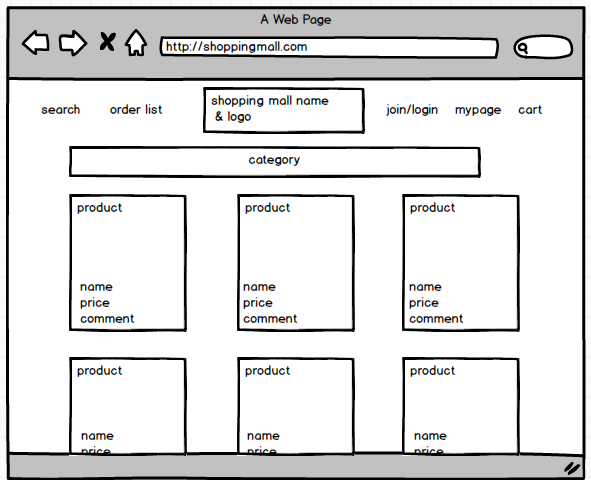

 

### 2) (상품목록 or 상품검색) 목록

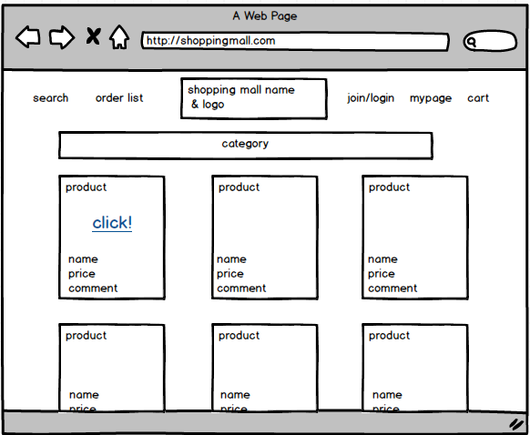

 

### 3) 상품 상세 조회

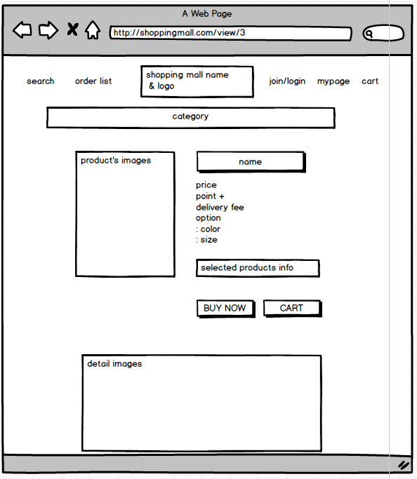

 

### 4) 장바구니 상품 추가

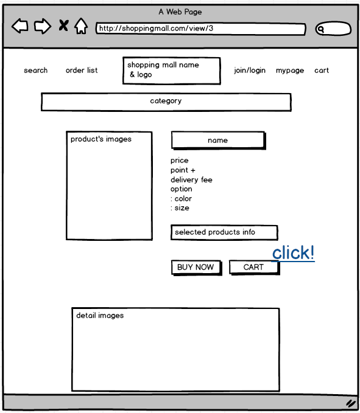

 

### 5) 장바구니 상품 확인

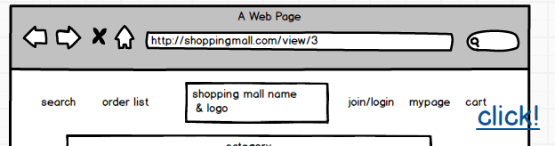

​																**cart 클릭**

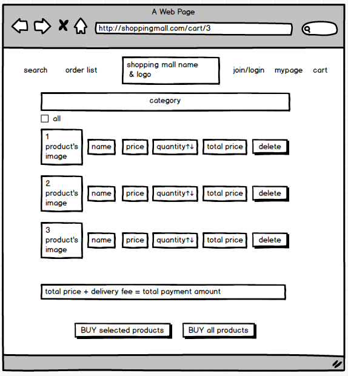

 

### 6) 장바구니 상품 삭제

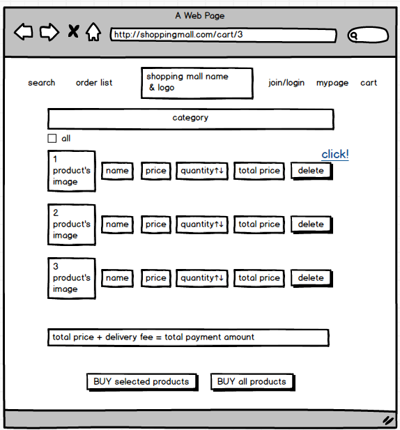

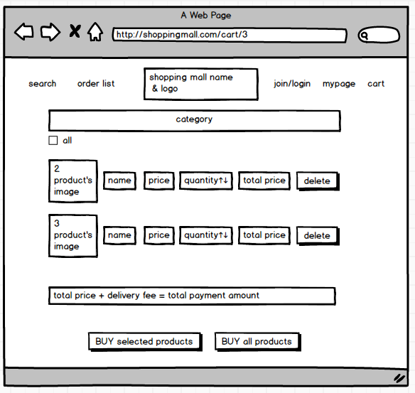

 

### 7) 상품 주문**(비회원)**

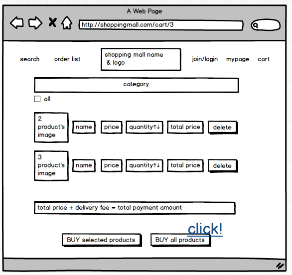

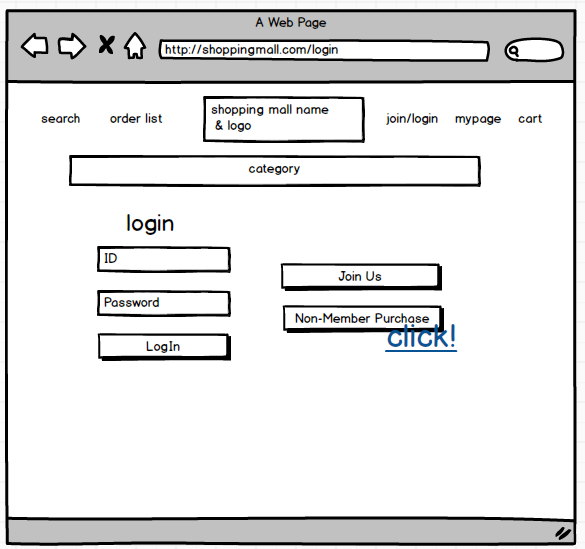

 

### 7-2) 상품 주문**(회원)**

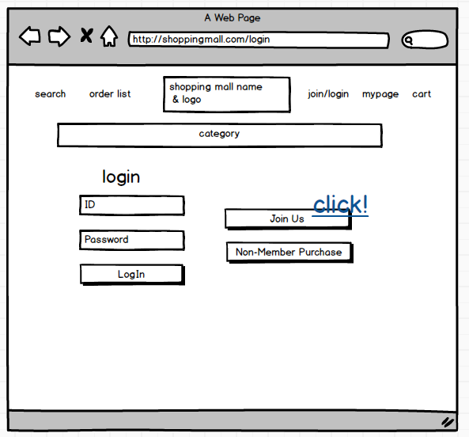

 

### 8) 회원가입**(비회원)**

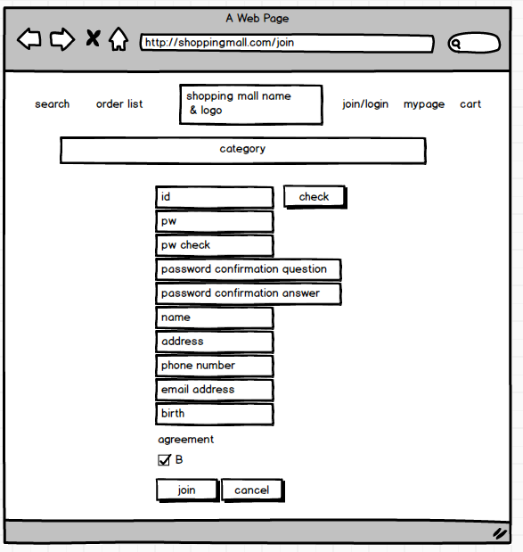

 

### 8) 로그인**(회원)**

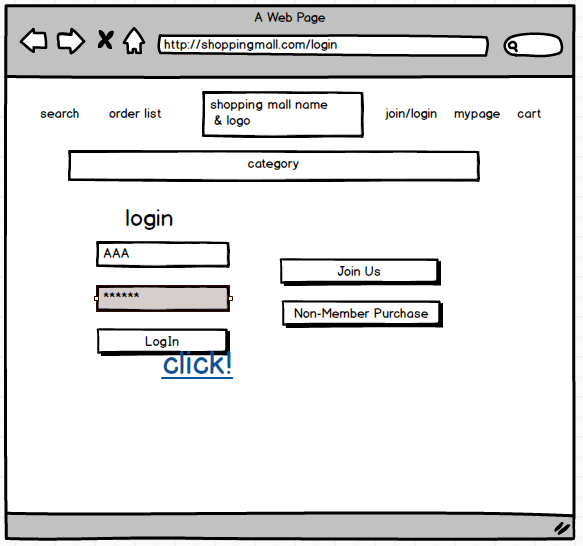

 

### 9) 주문결제

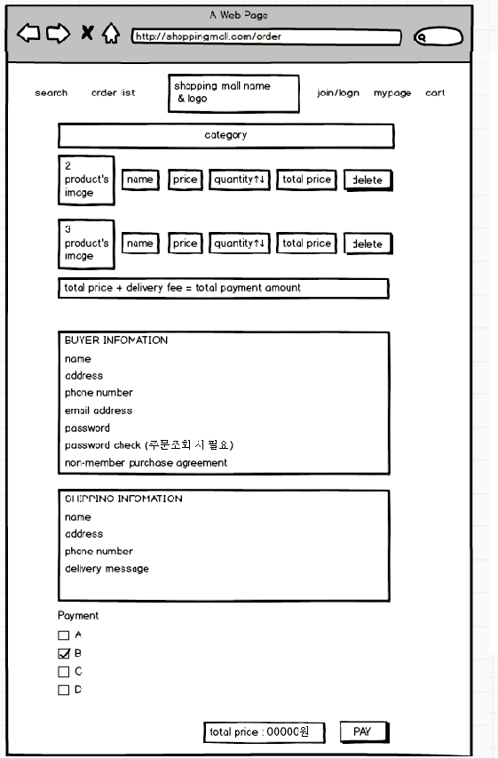

 

### 10) 구매내역확인(주문조회)

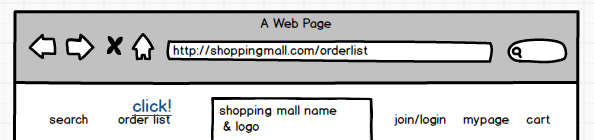

​		<b style="color:red">회원 or 비회원 구별</b>

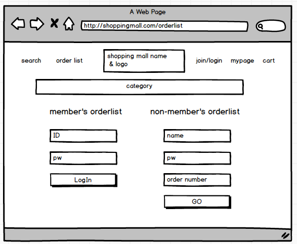

​		**주문 정보 리스트**

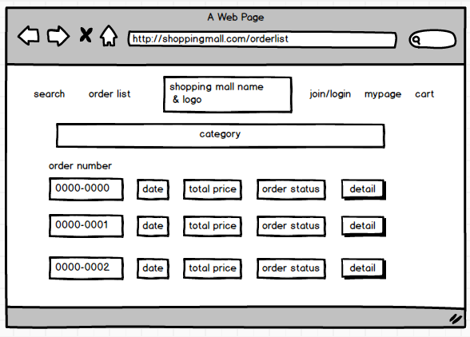

​		**주문 정보 상세보기**

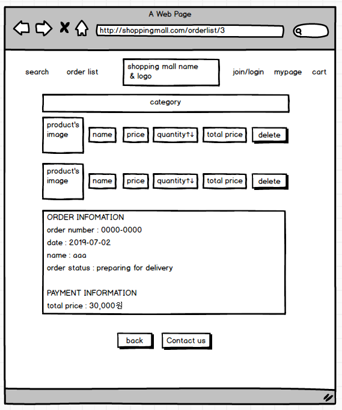

 

### 11) 로그아웃**(회원)**

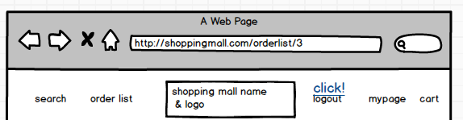

---

