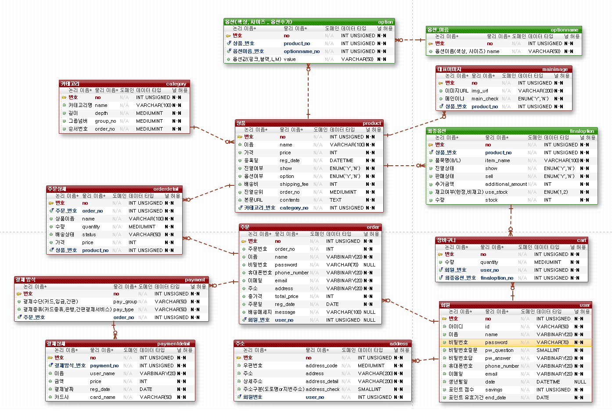
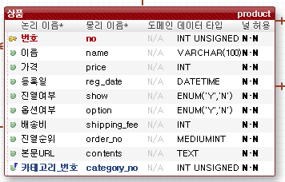
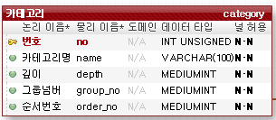
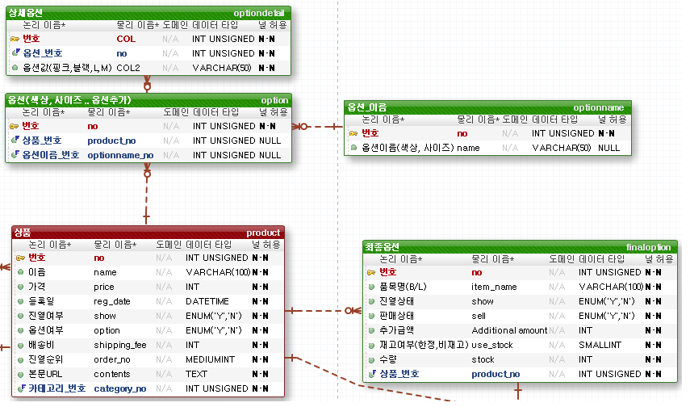
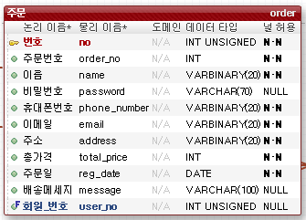
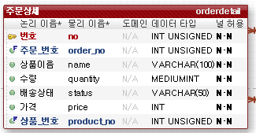
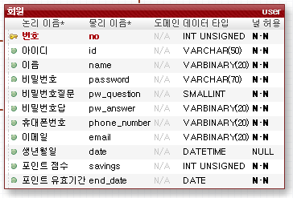
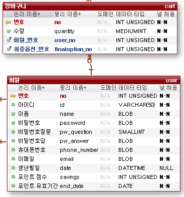
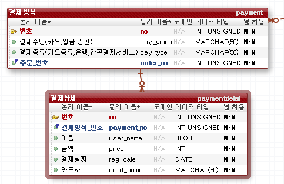
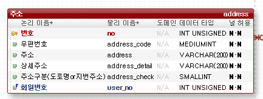

[TOC]

---

# [1] product (상품) 

- 상품 테이블에서 진열여부는 해당 상품을 리스트에서 보여줄 지 여부를 판단한다.
- 옵션여부는 해당 상품이 옵션(색상, 사이즈)과 같은 특성을 갖고 있는 지 여부를 판단한다.
- 진열순위는 default값이 1이며, 혹시 상위에 진열하고 싶은 상품에 관해 값을 줄 수 있다. l상품 리스트 페이지에서 `select`를 해올 경우 등록순(번호)으로 `order by`를 한 뒤, 진열 순위 컬럼을 `order by`한다.
- 본문은 에디터 라이브러리(미정)을 사용하여 html을 text로 넣을 것

 

# [2] category(카테고리)

- 카테고리 테이블은 상위 카테고리와 하위 카테고리를 나누기 위해 그룹넘버, 깊이 컬럼을 넣었다.

아래와 같이 카테고리가 있을 경우,

| 상의 : | 반팔   | 긴팔   | 나시   |
| ------ | ------ | ------ | ------ |
| 하의 : | 반바지 | 청바지 | 치마   |
| 신발 : | 운동화 | 구두   | 슬리퍼 |

[상의, 하의, 신발]이 상위 카테고리이다.

상의는 [반팔, 긴팔, 나시]의 부모 카테고리일 때, 이 4개의 카테고리의 `그룹넘버`는 같다.

`깊이`의 경우, 상의는 1의 값을 가지고, [반팔, 긴팔, 나시]의 경우 2의 값을 가진다.

만약, 긴팔 중에서도 [니트, 맨투맨, ...]등 하위 카테고리를 나눌 경우 `그룹넘버`는 같지만 그 하위의 `깊이` 값은 +1 이 될 것이다.

- 순서번호는 카테고리의 보여줄 순서를 지정하기 위해 넣었다. (default 1)

**ex) 예시 데이터**

| no   | name   | depth | group_no | order_no |
| ---- | ------ | ----- | -------- | -------- |
| 1    | 상의   | 1     | 1        | 1        |
| 2    | 반팔   | 2     | 1        | 1        |
| 3    | 긴팔   | 2     | 1        | 1        |
| 4    | 나시   | 2     | 1        | 1        |
| 5    | 니트   | 3     | 1        | 1        |
| 6    | 맨투맨 | 3     | 1        | 1        |
| 7    | 신발   | 1     | 2        | 1        |
| 8    | 운동화 | 2     | 2        | 1        |

 

# [3] option(옵션), finaloption(옵션)

- 옵션은 3개의 테이블로 나누었다.

  > 원래는 2개의 테이블로 나눴었다. 하지만 중복된 값들이 계속 들어가게 되어 4개로 늘렸다.
  >
  > (옷 쇼핑몰을 예로 들면 모든 상품은 `색상, 사이즈 ` 옵션을 갖기 마련인데, 데이터마다 계속  색상, 사이즈를 입력해주는 상황)

- `optionname` 테이블

  - 옵션의 이름만 저장하는 테이블 

    **ex) 예시 데이터**

    | no   | name   |
    | ---- | ------ |
    | 1    | 색상   |
    | 2    | 사이즈 |

    > 사용자가 옵션을 추가할 때, 이 테이블에 있는 값이면 그 옵션 이름의 번호를 사용하고,
    >
    > 테이블에 들어있지 않은 데이터 `모양`이라는 옵션을 새로 추가하는 옵션일 경우 아래와 같이 추가된다.
    >
    > | no   | name   |
    > | ---- | ------ |
    > | 1    | 색상   |
    > | 2    | 사이즈 |
    > | 3    | 모양   |

- `option` 테이블

  - 옵션 테이블에서는 해당 상품 번호와 옵션이름_번호를 저장한다.

    **ex) 예시 데이터**

    1번상품에 색상, 사이즈 옵션이 있고, 2번상품에 색상, 사이즈, 모양이 있는 경우.

    1번 상품의 색상 옵션에는 검정, 분홍, 초록이 있고, 1번 상품의 사이즈 옵션에는 L, M, S가 있고,

    2번 상품의 색상에는 파란, 초록이 있고, 모양 옵션에는 별모양, 하트모양만 있는 경우

    | no   | product_no | optionname_no | value |
    | ---- | ---------- | ------------- | ----- |
    | 1    | 1          | 1             | 검정  |
    | 2    | 1          | 1             | 분홍  |
    | 3    | 1          | 1             | 초록  |
    | 4    | 1          | 2             | L     |
    | 5    | 1          | 2             | M     |
    | 6    | 1          | 2             | S     |
    | 7    | 2          | 1             | 파란  |
    | 8    | 2          | 1             | 초록  |
    | 9    | 2          | 3             | 별    |
    | 10   | 2          | 3             | 하트  |

- `finaloption` 테이블

  - 재고 여부 (한정재고, 비재고)의 구분은 `ENUM(1,2)`타입으로 1일경우 한정, 2일경우 비재고를 Java enum을 활용

  - 1번상품의 `색상 옵션`에 색상 `옵션의 값`은 검정, 분홍, 초록이 있고, `사이즈 옵션 `의 사이즈 옵션 값은 L, M, S가 있다고 가정한다.

    그렇다면 총 옵션의 종류는 9가지가 된다.

    **[검정/L, 검정/M, 검정/S, 분홍/L, 분홍/M, 분홍/S, 초록/L, 초록/M, 초록/S]** 

    이 경우 1번 상품의 개수는 9개가 되는 셈이다.  

    하지만, 여기서 검정색은 M사이즈가 없고 초록색은 S사이즈가 없다고 가정한다면,  

    **[검정/L, 검정/S, 분홍/L, 분홍/M, 분홍/S, 초록/L, 초록/M]** 상품의 수는 7개가 된다. (클라이언트 측에서 옵션의 설정으로 추가/삭제)

    이렇게 최종으로 설정된 옵션의 값의 데이터들을 `finaloption` 테이블에 넣어줄 것이다.

    **ex) 예시 데이터** 

    | no   | product_no | item_name | show | sell | additional_amount | use_stock | stock |
    | ---- | ---------- | --------- | ---- | ---- | ----------------- | --------- | ----- |
    | 1    | 1          | 검정/L    | Y    | Y    | 100               | 1         | 100   |
    | 2    | 1          | 검정/S    | Y    | Y    | 0                 | 1         | 100   |
    | 3    | 1          | 분홍/L    | Y    | Y    | 100               | 1         | 100   |
    | 4    | 1          | 분홍/M    | Y    | Y    | 0                 | 1         | 100   |
    | 5    | 1          | 분홍/S    | Y    | Y    | 0                 | 1         | 100   |
    | 6    | 1          | 초록/L    | Y    | Y    | 100               | 1         | 100   |
    | 7    | 1          | 초록/M    | Y    | Y    | 0                 | 1         | 100   |

 

# [4] 주문(order)

- 비회원 주문일 경우 회원의 정보를 입력으로 받고, 회원일 경우 `user` 테이블에서 데이터를 가져와 넣어준다.
- 회원일 경우는 비밀번호가 필요없으며, 비회원일 경우 주문조회를 할 때 비밀번호를 입력받는다.
- 회원일 경우 회원 번호를 넣어주고, 비회원일 경우 넣어주지 않는다.
- 총 가격은 `product` 테이블의 가격과 `finaloption`의 추가 금액을 더한 가격이다.

 

# [4] 주문상세(orderdetail)

- 주문 상세의 경우 모든 상품을 가지고 있는 `order`테이블의 상세정보이다.

- 만약 한사람이 1, 2, 3 번 상품 3개를 구매했다면, 그 각각의 정보가 있는 테이블이다.

- 배송상태는 각각의 상품에 대한 배송 상태를 나타낸다.

  **ex) 예시 데이터**

  1번 주문에 대한 3가지 물품 데이터

  상품의 상세 데이터는 `product_no`으로 `product` 테이블과 join해서 가져온다.

  | no   | order_no | name   | quantity | status | price | product_no |
  | ---- | -------- | ------ | -------- | ------ | ----- | ---------- |
  | 1    | 1        | 반팔티 | 1        | 배송중 | 8000  | 1          |
  | 2    | 1        | 반바지 | 1        | 배송중 | 9000  | 2          |
  | 3    | 1        | 치마   | 1        | 배송중 | 8500  | 3          |

 

# [5] 회원(user)

- 회원 테이블의 회원 개인 정보와 관련된 컬럼은 암호화를 할 예정이다.
- 생년월일은 선택사항이다.
- 비밀번호 질문의 경우 java enum을 활용해 받을 예정이다.

 

# [6] 장바구니(cart)

- 장바구니는 `최종옵션_번호`에 해당하는 상품과 해당 상품의 수량을 저장할 수 있다.
- 조회시(SELECT) `WHERE 회원_번호=1`과 같이 해당 회원의 장바구니에 담긴 모든 상품을 가져온다.
- 상품 정보의 경우 `최종옵션_번호` 컬럼으로 `finaloption` 테이블과 join해서 가져온다.

 

# [7] 결제방식(payment) & 결제상세(paymentdetail)

- **결제 방식(payment) 예시 데이터**

  pay_group 예시 : 현금, 카드, 기타

  pay_type : 

  	- 현금 : 계좌이체, 무통장입금, 토스, ...
  	- 카드 : 페이코, 신용카드, 카카오페이, ...
  	- 기타 : 포인트, 쿠폰, ...

  | no   | pay_group | pay_type   | order_no |
  | ---- | --------- | ---------- | -------- |
  | 1    | 카드      | 신용카드   | 1        |
  | 2    | 카드      | 페이코     | 2        |
  | 3    | 현금      | 무통장입금 | 3        |
  | 4    | 현금      | 계좌이체   | 4        |
  | 5    | 기타      | 쿠폰       | 5        |
  | 6    | 기타      | 포인트     | 6        |
  | 7    | 카드      | 신용카드   | 6        |
  | 8    | 기타      | 쿠폰       | 6        |

- **결제 상세(paymentdetail)** 테이블의 경우 해당 `pay_type`의 상세 정보를 입력한다.

 

# [8] 주소(address)

- 주소의 경우 회원이 주문시 입력한 주소를 저장한다. (비회원 해당 X)

- 주소(address)테이블에 주소 데이터를 저장하는 이유 : 회원이 주문을 할 때 주소 자동 입력 기능을 위해

- 비회원의 경우 바로 `주문(order)` 테이블로 데이터가 들어가며, 회원일 경우 `주소(address)`에 저장을 하고 `주문(order)` 테이블로 들어가게 된다.

- 주소와 주문테이블은 서로 관계가 없다. (주문 완료 후 주소테이블 데이터를 변경한다고 가정했을 때 주문 테이블의 주소 데이터가 변경되면 안되기 때문)

  

