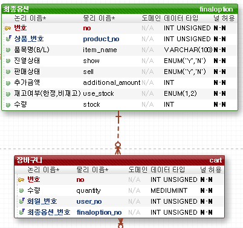
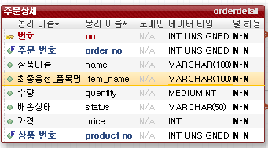
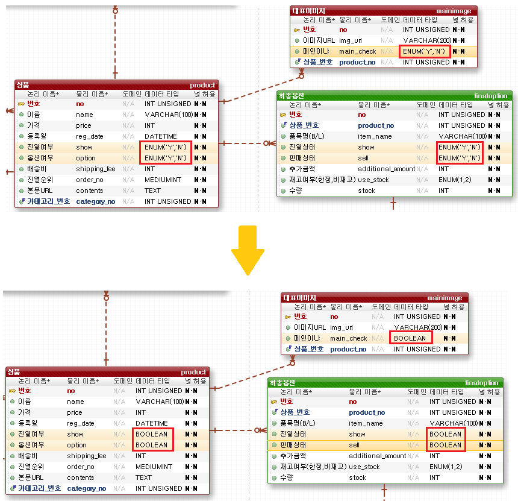
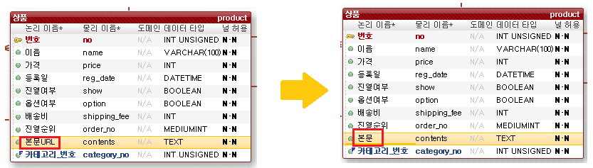
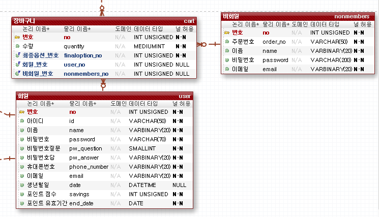

[TOC]

---

## [1] 주문에 옵션이름 추가

상품 옵션의 정보를 주문상세에 넣는 것을 깜빡했다.

장바구니의 경우 상품옵션과 관계를 맺어, 상품옵션 정보가 변경되면 변경되어야 하지만,

주문상세의 경우 상품옵션이 변경되어도 변경 이전에 주문한 내용이기에 변경되면 안된다.

> 관계를 맺지 않고 데이터를 넣어줌

 

## [2] ENUM->BOOLEAN 데이터 타입 변경

datatype변경

 

## [3] 상품 컬럼 name 변경

컬럼 name 변경(의미를 잘못 이해함)

## [4] 비회원 테이블 추가

기존에 비회원 장바구니는 쿠키에 저장하는 형식을 생각했었다.

하지만 쿠키는 보안이 취약하며,  쿠키를 저장할 수 있는 저장공간이 한정되어있다.

그래서 비회원 장바구니를 DB에 저장하는 것으로 변경했다

