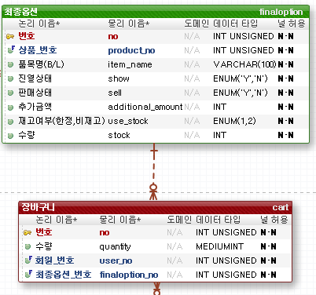
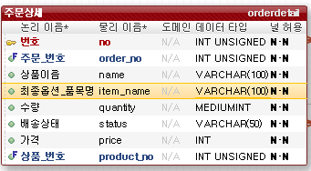
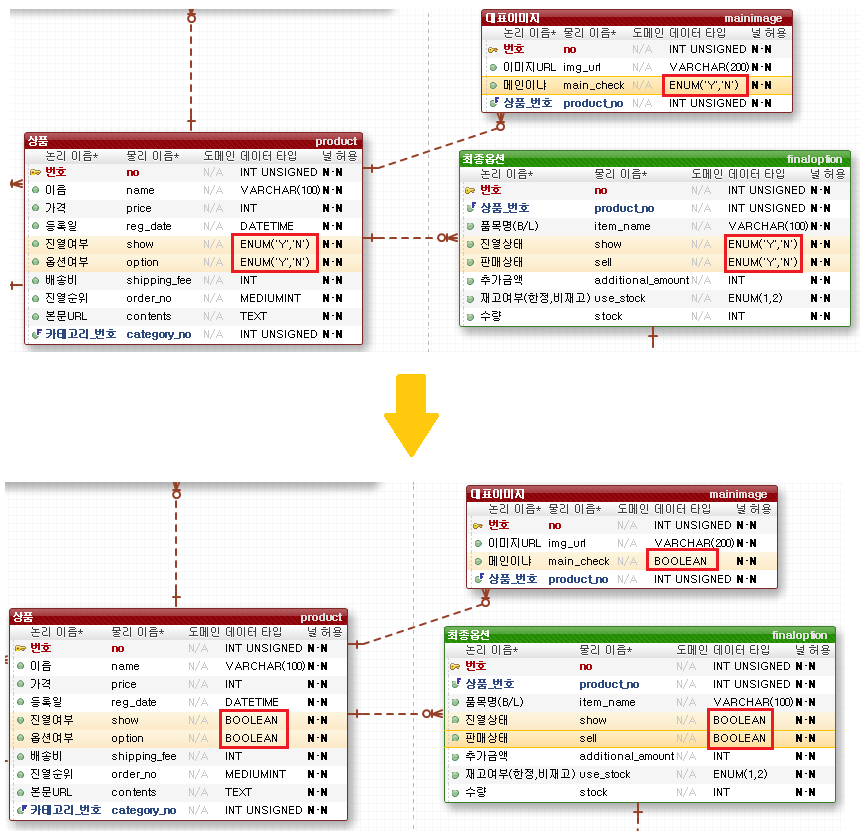
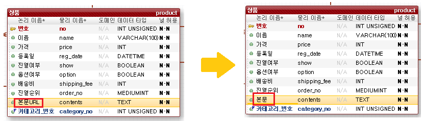

[TOC]

---

## [1]

상품 옵션의 정보를 주문상세에 넣는 것을 깜빡했다.

장바구니의 경우 상품옵션과 관계를 맺어, 상품옵션 정보가 변경되면 변경되어야 하지만,

주문상세의 경우 상품옵션이 변경되어도 변경 이전에 주문한 내용이기에 변경되면 안된다.

> 관계를 맺지 않고 데이터를 넣어줌

 

## [2] 

datatype변경

 

## [3]

컬럼 name 변경(의미를 잘못 이해함)

