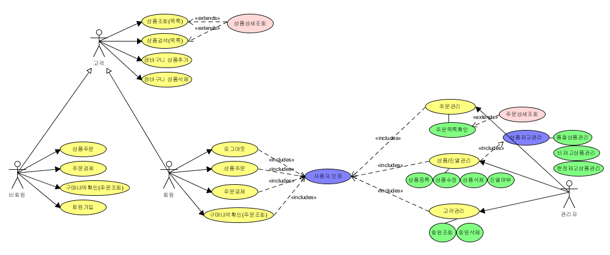
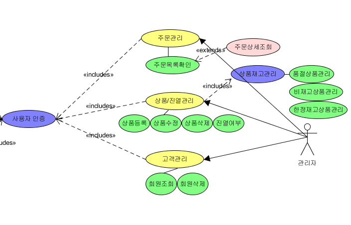
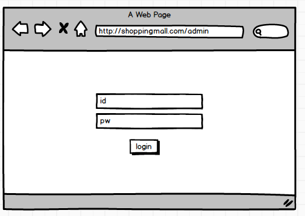
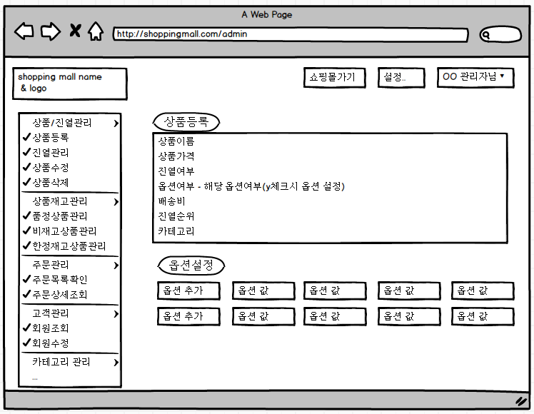
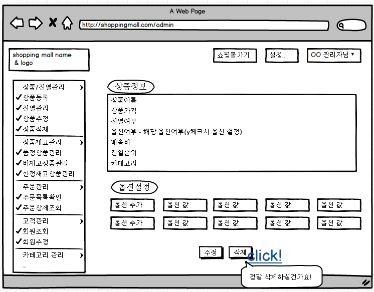
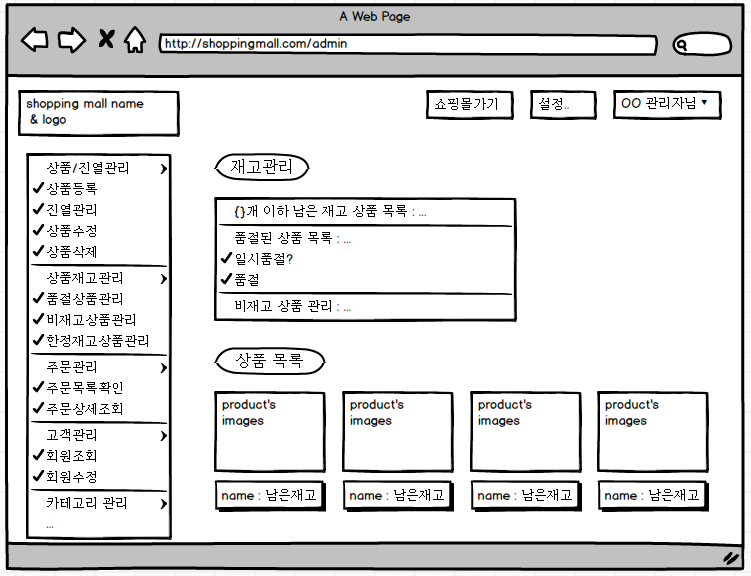
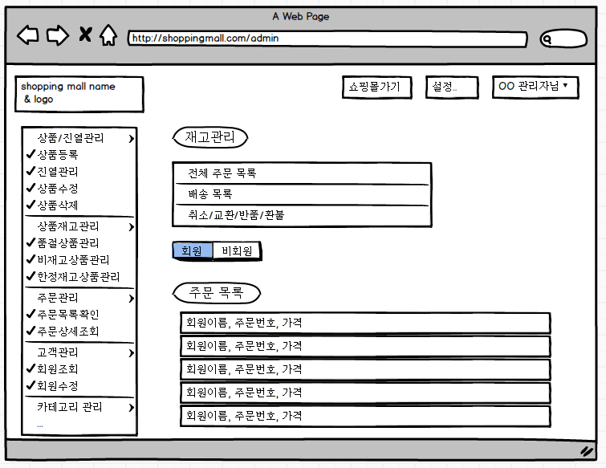
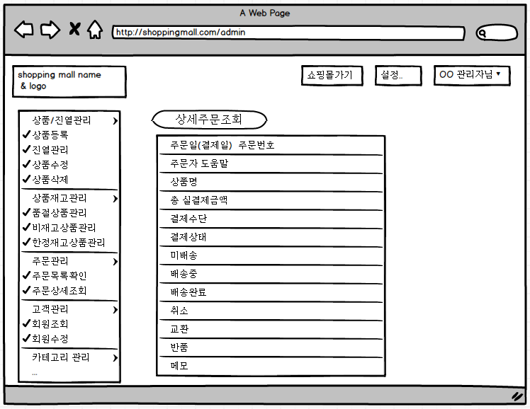
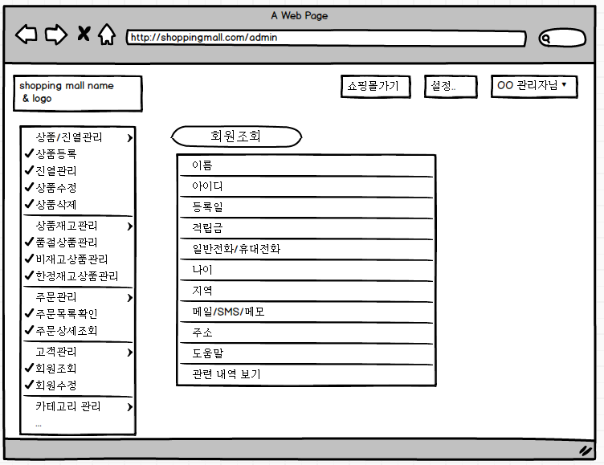
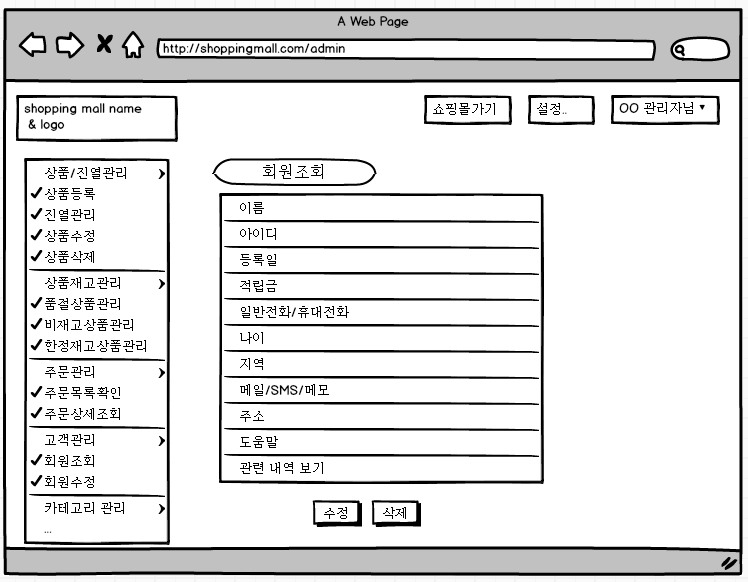

**전체 usecase**

**관리자 usecase**

[TOC]

# # 관리자

> 결제 관리, 포인트, 적립금은 확장예정 아직 구현 X

### 1) 쇼핑몰 관리자 페이지 접속

 

### 2) 사용자 인증(관리자 로그인)

 

### 3) 상품/진열 관리

#### 3-1) 상품 등록

상품 등록시 해당 상품의 세부 사항을 입력 후 상품 등록 진행

아래쪽엔 이미지 첨부로 등록

##### 3-1-1) 진열 여부 - 상품 진열여부

##### 3-1-2) 옵션 여부 - 선택시 옵션 설정

#### 3-2) 상품 수정 

#### 3-3) 상품 삭제

 

### 4) 상품 재고 관리

#### 4-1) 품절 상품 관리

#### 4-2) 비재고 상품 관리

#### 4-3) 한정 재고 상품 관리

 

### 5) 주문관리

#### 5-1) 주문 목록 확인

 

### 6) 주문 상세 조회

 

### 7) 고객관리

#### 7-1) 회원조회

#### 7-2) 회원삭제

