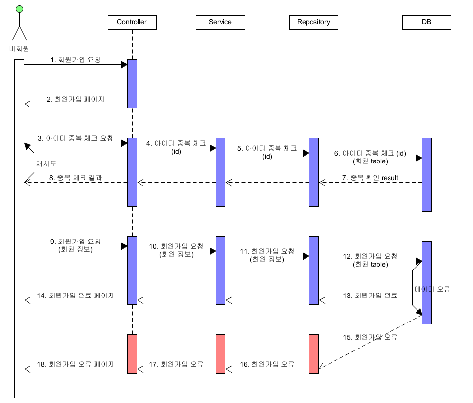
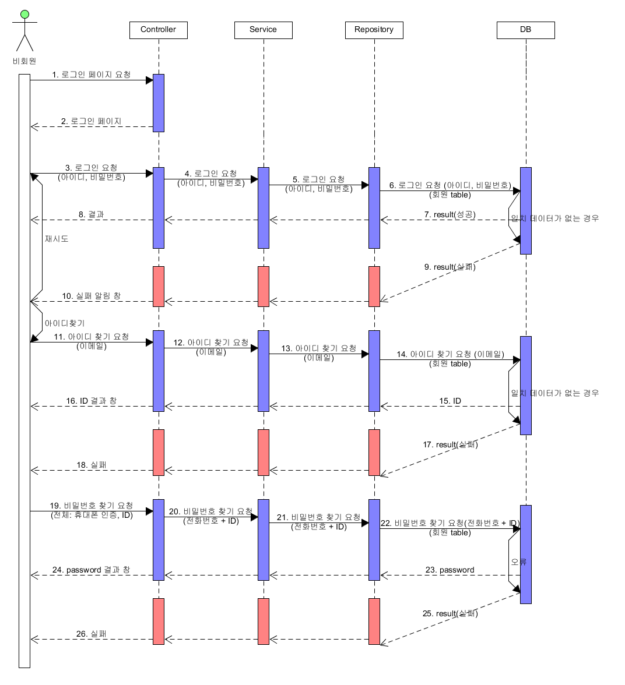
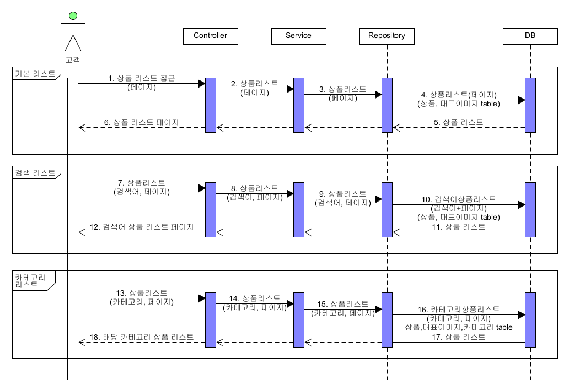
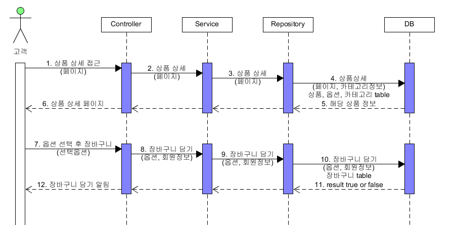
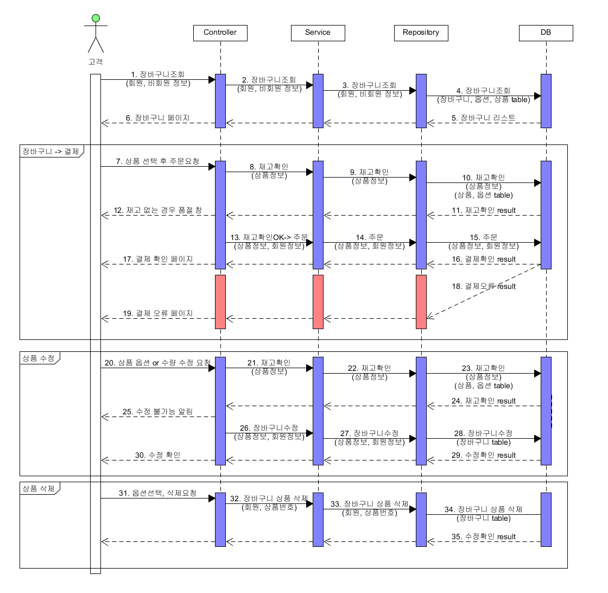
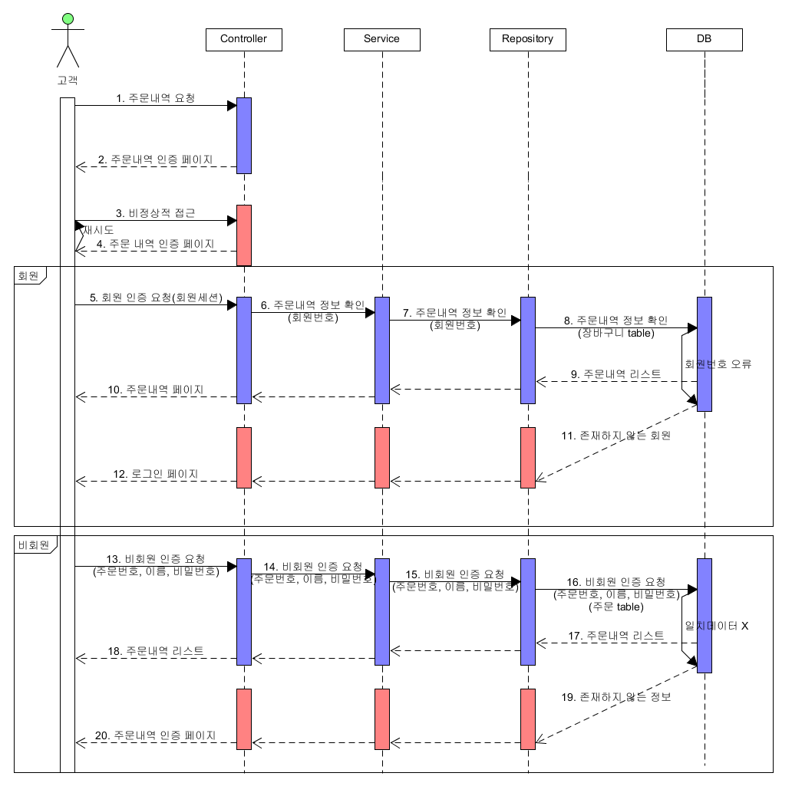

[TOC]

---

상세에 바로주문 넣기

# 1. 회원가입



## 🎈Controller Test

### 1) 회원가입 요청 TDD

**UserControllerTest.java**

```java
@Test
public void testJoinUser() throws Exception {

    UserVo userVo = new UserVo();
    userVo.setId("testId");
    userVo.setName("testUser");
    userVo.setPassword("1234");
    userVo.setPasswordQuestion("가장 아끼는 보물은?");
    userVo.setPasswordAnswer("수첩");
    userVo.setPhoneNumber("010-9274-3036");
    userVo.setEmail("leeap1004@gmail.com");

    ResultActions resultActions = 
        mockMvc
        .perform(post("/user/join")
                 .contentType(MediaType.APPLICATION_JSON).content(new Gson().toJson(userVo)));

    resultActions 
        .andExpect(status().isOk()).andDo(print())
        .andExpect(jsonPath("$.result", is("success") ))
        .andExpect(jsonPath("$.result", is("success") ))
        .andExpect(jsonPath("$.data.name", is(userVo.getName())))
        .andExpect(jsonPath("$.data.phoneNumber", is(userVo.getPhoneNumber())));
}
```

**UserController.java**

```java
@Controller
@RequestMapping("/user")
public class UserController {

	@RequestMapping(value="/join", method=RequestMethod.POST) 
	public JSONResult joinUser(@RequestBody UserVo userVo) {
		return JSONResult.success(userVo);
	}
}
 
```

### 2) 아이디 중복체크

**UserControllerTest.java**

```java
@Test
public void testCheckId() throws Exception {

    String id = "userId";

    ResultActions resultActions = 
        mockMvc
        .perform(get("/api/user/checkId?id={id}", id)
                 .contentType(MediaType.APPLICATION_JSON));

    resultActions 
        .andExpect(status().isOk()).andDo(print())
        .andExpect(jsonPath("$.result", is("success") ))
        .andExpect(jsonPath("$.data", is(false))); 
    //  false : 회원가입 가능, true : 중복 아이디 존재
}
```

**UserController.java**

```java
@RequestMapping(value="/checkId", method=RequestMethod.GET) 
public JSONResult checkId(@RequestParam(value="id") String id) {
    Boolean exist = false;
    return JSONResult.success(exist);
} 
```


## 🎈 UserService 추가

**UserController.java**

```java
@RestController("userAPIController")
@RequestMapping("/api/user")
public class UserController {

    @Autowired
    private UserService userService;

    @RequestMapping(value="/join", method=RequestMethod.POST) 
    public JSONResult joinUser(@RequestBody UserVo userVo) {
        UserVo vo = userService.joinUser(userVo);
        return JSONResult.success(vo);
    }

    @RequestMapping(value="/checkId", method=RequestMethod.GET) 
    public JSONResult checkId(@RequestParam(value="id") String id) {
        Boolean exist = false;
        return JSONResult.success(exist);
    } 

}
```

**UserService.java**

```java
@Service
public class UserService {
	public UserVo joinUser(UserVo userVo) {
		return userVo;
	}
	
	public Boolean checkId( String id) {
		Boolean exist = false;
		return exist;
	} 
}
```


## 🎈 UserDao 추가

**UserController.java**

```java
@RestController("userAPIController")
@RequestMapping("/api/user")
public class UserController {
	
	@Autowired
	private UserService userService;

	@RequestMapping(value="/join", method=RequestMethod.POST) 
	public JSONResult joinUser(@RequestBody UserVo userVo) {
		UserVo vo = userService.joinUser(userVo);
		return JSONResult.success(vo);
	}

	@RequestMapping(value="/checkId", method=RequestMethod.GET) 
	public JSONResult checkId(@RequestParam(value="id") String id) {
		Boolean exist = userService.checkId(id);
		return JSONResult.success(exist);
	} 
}
```

**UserService.java**

```java
@Service
public class UserService {
	@Autowired
	private UserDao userDao;
	
	public UserVo joinUser(UserVo userVo) {
		System.out.println("들어가기전 !!!!");
		UserVo vo = userDao.insert(userVo);
		System.out.println("들어갔다옴!@!@!@!!!!");
		return vo;
	}
	
	public Boolean checkId( String id) {
		Boolean exist = userDao.getId(id);
		return exist;
	} 
}
```

**UserDao.java**

```java
@Repository
public class UserDao {
    @Autowired 
    private SqlSession sqlSession;

    public UserVo insert(UserVo vo) {
        return vo;
    }

    public Boolean getId(String id) {
        return false;
    }
}
```


### + 회원가입 유효성(정규식) 검사 추가

**UserController.java**

```java
@RequestMapping(value="/join", method=RequestMethod.POST) 
public ResponseEntity<JSONResult> joinUser(@RequestBody @Valid UserVo userVo,
                                           BindingResult result) {

    if(result.hasErrors()) {
        List<ObjectError> allErrors = result.getAllErrors();
        for(ObjectError error : allErrors) {
            return ResponseEntity.status(HttpStatus.BAD_REQUEST).body(JSONResult.fail(error.getDefaultMessage()));
        }
    }

    // 유효성검사
    if(!Pattern.matches(UserVo.CHECK_ID_VALID, userVo.getId())) {
        return ResponseEntity.status(HttpStatus.BAD_REQUEST).body(JSONResult.fail("잘못된 아이디 형식입니다."));
    }else if(!Pattern.matches(UserVo.CHECK_PASSWORD_VALID, userVo.getPassword())) {
        return ResponseEntity.status(HttpStatus.BAD_REQUEST).body(JSONResult.fail("잘못된 비밀번호 형식입니다."));
    }else if(!Pattern.matches(UserVo.CHECK_PHONE_VALID, userVo.getPhoneNumber())) {
        return ResponseEntity.status(HttpStatus.BAD_REQUEST).body(JSONResult.fail("잘못된 전화번호 형식입니다."));
    }else if(!Pattern.matches(UserVo.CHECK_NAME_VALID, userVo.getName())){
        return ResponseEntity.status(HttpStatus.BAD_REQUEST).body(JSONResult.fail("잘못된 이름 형식입니다."));
    }

    UserVo vo = userService.joinUser(userVo);
    return ResponseEntity.status(HttpStatus.OK).body(JSONResult.success(vo));
}
```

**UserVo.java**

```java
public class UserVo {

    // 영문시작 특수문자 불가능('-'가능), 5~12자 
    public static final String CHECK_ID_VALID = "^[a-zA-Z]{1}[a-zA-Z0-9_]{4,11}$";

    // 정규식 (영문(대소문자 구분), 숫자, 특수문자 조합, 9~12자리)
    public static final String CHECK_PASSWORD_VALID = "^(?=.*\\d)(?=.*[~`!@#$%\\^&*()-])(?=.*[a-z])(?=.*[A-Z]).{9,12}$";

    // 전화번호 정규식
    public static final String CHECK_PHONE_VALID = "^01(?:0|1|[6-9])-(?:\\d{3}|\\d{4})-\\d{4}$"; 

    // 영문 혹은 한글 이름(둘 다 사용 불가)
    public static final String CHECK_NAME_VALID = "^[가-힣]{2,4}|^[a-zA-Z]*$";

    private Long no;

    @NotEmpty(message="아이디를 입력해주세요.")
    private String id;

    @NotEmpty(message="이름을 입력해주세요")
    @Length(min = 2, max = 8, message="이름 형식이 잘못되었습니다.")
    private String name;

    @NotEmpty(message="비밀번호를 입력해주세요")
    private String password;

    private String passwordQuestion;

    @Length(min = 2, message="답변은 2글자 이상을 입력해주세요.")
    private String passwordAnswer;

    @NotEmpty(message="전화번호를 입력해주세요")
    private String phoneNumber;

    @Email(message="이메일 형식이 맞지 않습니다.")
    @NotEmpty(message="이메일을 입력해주세요")
    private String email;
    private String birthDate;

    private String point;
    private String endDate;

    public UserVo() {
        super();
    }

    public UserVo(String id, String name, String password, String passwordQuestion, 
                  String passwordAnswer, String phoneNumber, String email) {
        this.id = id;
        this.name = name;
        this.password = password;
        this.passwordQuestion = passwordQuestion;
        this.passwordAnswer = passwordAnswer;
        this.phoneNumber = phoneNumber;
        this.email = email;
    }
    ...
}

```


# 2. 로그인



## 🎈Controller Test

### 1) 로그인 요청 TDD

**UserControllerTest.java**

```java
@Test
public void testlogin() throws Exception {

    String id = "userId";
    String password = "userPW";

    ResultActions resultActions = 
        mockMvc
        .perform(get("/api/user/login?id={id}&password={password}", id, password)
                 .contentType(MediaType.APPLICATION_JSON));

    resultActions 
        .andExpect(status().isOk()).andDo(print())
        .andExpect(jsonPath("$.result", is("success") ))
        .andExpect(jsonPath("$.data", is(false))); 
    //  false : 로그인 실패, true : 로그인 가능
}
```

**UserController.java**

```java
@RequestMapping(value="/login", method=RequestMethod.GET) 
public JSONResult login(@RequestParam(value="id") String id, @RequestParam(value="password") String password) {
    Boolean exist = userService.getUser(id, password);
    return JSONResult.success(exist);
} 
```

**UserService.java**

```java
public Boolean getUser(String id, String password) {
    Boolean exist = userDao.get(id, password);
    return exist;
}
```

**UserDao.java**

```java
public Boolean get(String id, String password) {
    return false;
}
```

> 이후는 Controller 코드만 첨부함


### 2) 아이디 찾기 요청 TDD

> email을 회원table에서 찾아, 있으면 해당 메일로 ID전송 or 인증번호 전송

**UserController.java**

```java
@RequestMapping(value="/findId", method=RequestMethod.GET) 
public JSONResult findId(@RequestParam(value = "email") String email) {
    String userId = userService.getUser(email);
    return JSONResult.success(userId);
} 
```

**UserControllerTest.java**

```java
@Test
public void findId() throws Exception {

    String email = "leeap1004@gmail.com";

    ResultActions resultActions = 
        mockMvc
        .perform(get("/api/user/findId?email={email}", email)
                 .contentType(MediaType.APPLICATION_JSON));

    resultActions 
        .andExpect(status().isOk()).andDo(print())
        .andExpect(jsonPath("$.result", is("success") ))
        .andExpect(jsonPath("$.data", is(email))); 
}
```


### 3) 비밀번호 찾기 요청 TDD

> email을 회원table에서 찾아, 있으면 해당 메일로 임의 변경 PW전송 or 인증번호 전송


# 3. 상품 목록



## Controller Test

### 1) 상품리스트 가져오기 TDD

**UserControllerTest.java**

```java

```


# 4. 상품 상세




# 5. 장바구니




# 6. 주문내역 확인




