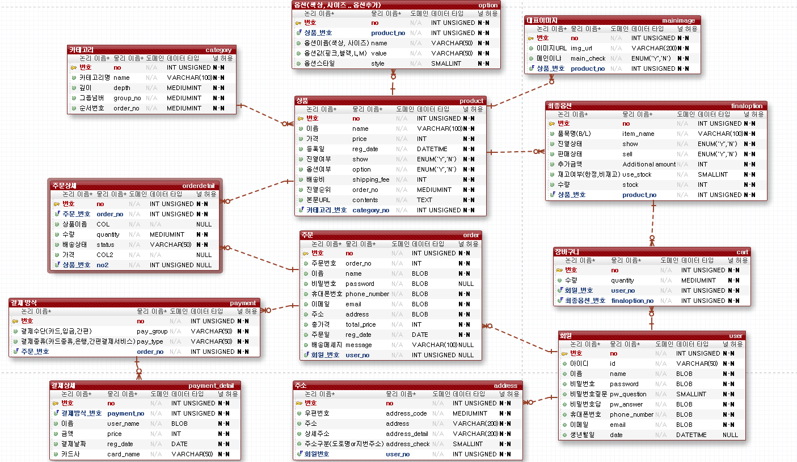
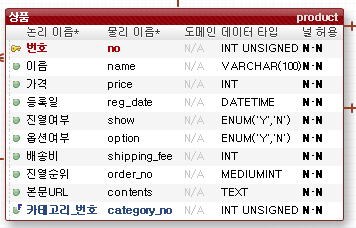
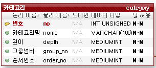
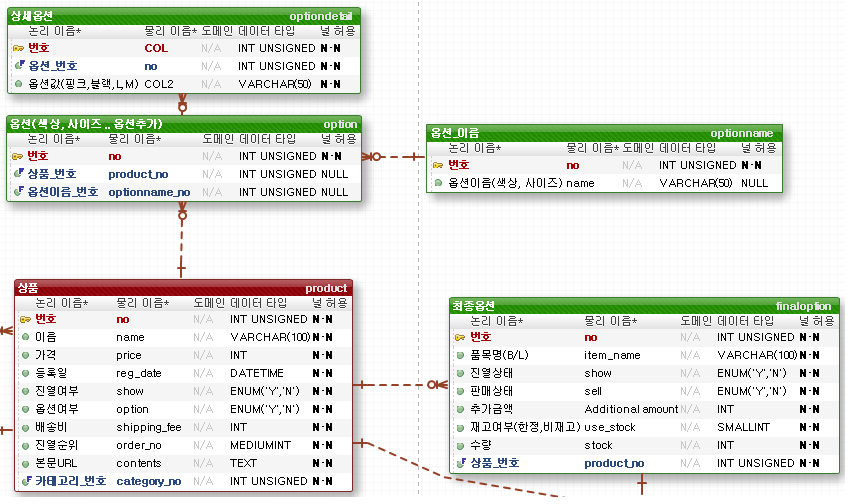

[TOC]

---

---

# [1] product (상품) 

- 상품 테이블에서 진열여부는 해당 상품을 리스트에서 보여줄 지 여부를 판단한다.
- 옵션여부는 해당 상품이 옵션(색상, 사이즈)과 같은 특성을 갖고 있는 지 여부를 판단한다.
- 진열순위는 default값이 1이며, 혹시 상위에 진열하고 싶은 상품에 관해 값을 줄 수 있다. l상품 리스트 페이지에서 `select`를 해올 경우 등록순(번호)으로 `order by`를 한 뒤, 진열 순위 컬럼을 `order by`한다.
- 본문은 에디터 라이브러리(미정)을 사용하여 html파일로 저장한 뒤, 해당 상품의 URL로 html을 불러올 예정이다. 

 

# [2] category(카테고리)

- 카테고리 테이블은 상위 카테고리와 하위 카테고리를 나누기 위해 그룹넘버, 깊이 컬럼을 넣었다.

아래와 같이 카테고리가 있을 경우,

| 상의 : | 반팔   | 긴팔   | 나시   |
| ------ | ------ | ------ | ------ |
| 하의 : | 반바지 | 청바지 | 치마   |
| 신발 : | 운동화 | 구두   | 슬리퍼 |

[상의, 하의, 신발]이 상위 카테고리이다.

상의는 [반팔, 긴팔, 나시]의 부모 카테고리일 때, 이 4개의 카테고리의 `그룹넘버`는 같다.

`깊이`의 경우, 상의는 1의 값을 가지고, [반팔, 긴팔, 나시]의 경우 2의 값을 가진다.

만약, 긴팔 중에서도 [니트, 맨투맨, ...]등 하위 카테고리를 나눌 경우 `그룹넘버`는 같지만 그 하위의 `깊이` 값은 +1 이 될 것이다.

- 순서번호는 카테고리의 보여줄 순서를 지정하기 위해 넣었다. (default 1)

**ex) 예시 데이터**

| no   | name   | depth | group_no | order_no |
| ---- | ------ | ----- | -------- | -------- |
| 1    | 상의   | 1     | 1        | 1        |
| 2    | 반팔   | 2     | 1        | 1        |
| 3    | 긴팔   | 2     | 1        | 1        |
| 4    | 나시   | 2     | 1        | 1        |
| 5    | 니트   | 3     | 1        | 1        |
| 6    | 맨투맨 | 3     | 1        | 1        |
| 7    | 신발   | 1     | 2        | 1        |
| 8    | 운동화 | 2     | 2        | 1        |

 

# [3] option(옵션), finaloption(옵션)

- 옵션은 두 개의 테이블로 나누었다.

- (원래는 3개의 테이블로 나눴었다. 하지만 많은 join을 최대한 줄이고자 2개로 줄여봤다. )

- `<option>` 테이블에서는 해당 상품 번호의 옵션의 종류를 설정한다.

- 1번상품에는 `색상 옵션`에 색상 `옵션의 값`은 검정, 분홍, 초록이 있고, `사이즈 옵션 `이 있으며 이의 `사이즈 옵션` 값은 L, M, S가 있다고 가정한다.

  그렇다면 총 옵션의 종류는 9가지가 된다. (검정/L, 검정/M, 검정/S, 분홍/L, 분홍/M, 분홍/S, 초록/L, 초록/M, 초록/S)

  이 경우 1번 상품의 개수는 9개가 되는 셈이다.  하지만, 여기서 검정색은 M사이즈가 없고 초록색은 S사이즈가 없다고 가정한다면,  (검정/L, 검정/S, 분홍/L, 분홍/M, 분홍/S, 초록/L, 초록/M) 상품의 수는 7개가 된다. (이는 클라이언트 측에서 옵션의 설정으로 추가/삭제 할 수 있도록 구현해보자..!)

  이렇게 설정된 옵션의 값의 데이터들을 `최종옵션` 테이블에 넣어줄 것이다.

**ex) 예시 데이터** 

**(1) option table**

- 옵션 `style` 컬럼은 해당 옵션의  클라이언트 쪽 스타일을 지정해 줄 것이다. (드롭다운, 체크박스 ... 등 옵션을 선택할 수 있는 스타일)
- 스타일의 개수는 정해져 있으니 int로 받아 java code에서 enum을 활용해 처리할 것이다. (1-드롭다운, 2-체크박스 ..)

| no   | product_no | name   | value | style |
| ---- | ---------- | ------ | ----- | ----- |
| 1    | 1          | 색상   | 검정  | 1     |
| 2    | 1          | 색상   | 분홍  | 1     |
| 3    | 1          | 색상   | 초록  | 1     |
| 4    | 1          | 사이즈 | L     | 1     |
| 5    | 1          | 사이즈 | M     | 1     |
| 6    | 1          | 사이즈 | S     | 1     |
| 7    | 2          | 색상   | 검정  | 1     |

> 여기서 고민은 옵션의 중복되는 데이터 값이 너무 많다는 점이다. 
>
> (테이블을 하나 더 만들어 join을 할지,, 이대로 갈지,, 고민,,,)

**(2) option table**

최종 상품의 상세 정보

`show`: 상품 옵션을 보여줄 지 여부(일시품절)

`sell` : 해당 옵션의 상품을 판매하는 지 여부(품절)

`user_stock`의 경우 한정재고인지 비재고인지의 여부를 결정한다. (Java에서 Enum을 활용해 1-한정재고, 2-비재고의 구분을 생각했다.)

| no   | item_name | show | sell | additional amount | user_stock | stock | product_no |
| ---- | --------- | ---- | ---- | ----------------- | ---------- | ----- | ---------- |
| 1    | 검정/L    | Y    | Y    | 100               | 1          | 100   | 1          |
| 2    | 검정/S    | Y    | Y    | 0                 | 1          | 100   | 1          |
| 3    | 분홍/L    | Y    | Y    | 100               | 1          | 100   | 1          |
| 4    | 분홍/M    | Y    | Y    | 0                 | 1          | 100   | 1          |
| 5    | 분홍/S    | Y    | Y    | 0                 | 1          | 100   | 1          |
| 6    | 초록/L    | Y    | Y    | 100               | 1          | 100   | 1          |
| 7    | 초록/M    | Y    | Y    | 0                 | 1          | 100   | 1          |

> 1번 상품의 옵션들 -> 이 테이블의 데이터들이 실질적으로 장바구니와 주문정보에 들어가게 된다.

 

