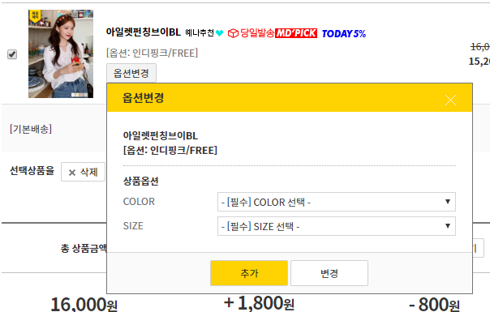

# 장바구니 상품 옵션가져오기  API ( /api/nonuser/cart/getOptionList) 

- 해당 옵션 번호의 상품이 가진 모든 옵션 목록을 가져온다.

  > 장바구니 상품 중 옵션을 변경할 상품의 옵션을 click한 순간 ajax로 보낼 데이터 목록
  >
  > 
  >
  > > 예시 : 육육걸즈 쇼핑몰

■ request: 
   post 
     params: RequestNonUserAddCartDto

> ```
> no: 상품 옵션 번호
> ```


■ response: 
     200: 성공

​	400: 실패 

parameter의 형식 오류, 빈값인 경우


■ 실제동작코드 

**UserController.java**

```java
@ApiOperation(value="장바구니 상품의 옵션 목록 가져오기")
@ApiImplicitParams({
    @ApiImplicitParam(name="no", value="no: 상품옵션번호", required=false, dataType="long", defaultValue="")
})
@GetMapping(value = "/cart/getOptionList")
public JSONResult getOptionList(
    @RequestParam(value="no", required = true, defaultValue = "") Long no
			) {
		// 상품의 옵션 list return
		List<OptionNameVo> list = productService.getOptionList(no);
		return JSONResult.success(list);
	}
```

<br>

■ TC CODE 

```java
@Test
public void getOptionList() throws Exception {
    String no = "8";

    ResultActions resultActions =
        mockMvc
        .perform(get("/api/nonuser/cart/getOptionList")
                 .param("no", no)	
                 .contentType(MediaType.APPLICATION_JSON));


    resultActions 
        .andExpect(status().isOk()).andDo(print());
}
```
