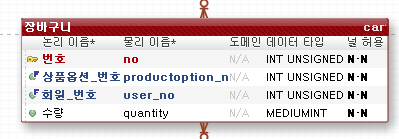
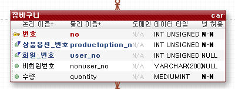
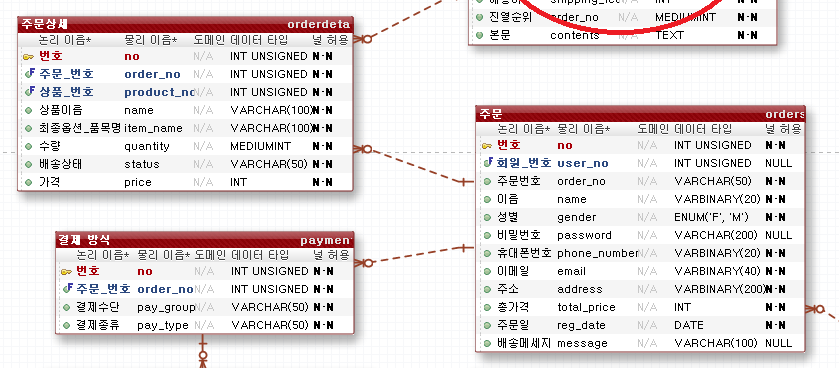
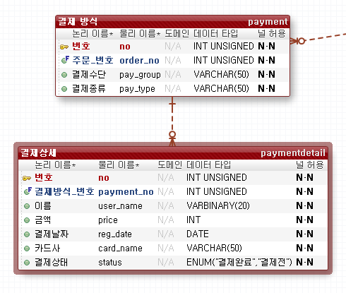

작업 계획 (테이블)

# TODO LIST

- mall_id 테이블 만들기
- 모든 컬럼에 mall_id 추가하기
- ~~상품 등록, 옵션 등록 합치기~~
- 이미지 업로드 (대표사진)
- user table role 수정 => ROLE_USER, ROLE_ADMIN
- ~~주문시 재고 확인, 결제됐는지 확인 -> 어떤 제품이 재고가 없는지 확인~~
- ~~주문시 장바구니 비우기~~
- 장바구니 담을때도 재고 확인하기 -> `orderDao.stockCheck()`
- ~~발리데이션 추가하기 ( 커스텀 )~~
- 파라미터 받기 형식 수정하기 (파람, 패스배리어블)
- db예외처리

✨장바구니 erd 수정하기✨

**개선**

-> 비회원 컨트롤러 -> 비회원 기능 나누기

> 나중에 시큐리티  적용하고 `antMatch("/nonuser**").permitAll()` 이런식으로 나누기위해

---

## [비회원]

### - `/api/nonuser/{url}`

| API목록          | url      | 예상일정 | 예상소요시간 | 개발일정 | 개발시간 | 작업결과서                                                   |
| ---------------- | -------- | -------- | ------------ | -------- | -------- | ------------------------------------------------------------ |
| 회원가입 API     | /join    | 07.16    | 2h (2시간)   | 07.16    | 2h       | [보기](https://github.com/jungeunlee95/shopping-mall/wiki/회원가입) |
| 아이디 중복 검사 | /checkId | 07.16    | 1h (1시간)   | 07.16    | 1h       | [보기](https://github.com/jungeunlee95/shopping-mall/wiki/아이디중복검사) |
| 아이디 찾기      | /findId  | 07.16    | 1h (1시간)   | 07.16    | 1h       | [보기](https://github.com/jungeunlee95/shopping-mall/wiki/아이디찾기) |
| 로그인 API       | /login   | 07.16    | 1h (1시간)   | 07.16    | 1h       | [보기](https://github.com/jungeunlee95/shopping-mall/wiki/로그인) |

## [회원]

###  - `/api/user/{url}`

| API목록                     | url             | 예상일정 | 예상소요시간 | 개발일정 | 개발시간 | 작업결과서                                                   |
| --------------------------- | --------------- | -------- | ------------ | -------- | -------- | ------------------------------------------------------------ |
| 회원정보수정                | /modify         | 07.17    | 1h (1시간)   | 07.17    | 2h       | [보기](https://github.com/jungeunlee95/shopping-mall/wiki/회원정보수정) |
| 회원삭제(탈퇴)              | /delete         | 07.17    | 1h (1시간)   | 07.17    | 30h      |                                                              |
| 회원 주소지 등록            | /addAddress     |          |              |          |          |                                                              |
| 회원 주소지 삭제            | /deleteAddress  |          |              |          |          |                                                              |
| 회원 주소지 리스트 가져오기 | /getAddressList |          |              |          |          |                                                              |
| 회원 주소지 하나 가져오기   | /getAddress     |          |              |          |          |                                                              |

### - `/api/admin/user/{url}`

| API목록    | url       | 예상일정 | 예상소요시간 | 개발일정 | 개발시간 | 작업결과서 |
| ---------- | --------- | -------- | ------------ | -------- | -------- | ---------- |
| 회원리스트 | /userList |          |              |          |          |            |

 

## [카테고리]

### - `/api/admin/category/{url}`

| API목록                | url                    | 예상일정 | 예상소요시간 | 개발일정 | 개발시간 | 작업결과서 |
| ---------------------- | ---------------------- | -------- | ------------ | -------- | -------- | ---------- |
| 상위카테고리 중복 검사 | /checkName?name={name} | 07.18    | 1h           | 07.18    | 2h       |            |
| 하위카테고리 중복 검사 | /checkLowName          | 07.18    | 30m          | 07.18    | 1h       |            |
| 상위 카테고리 등록     | /add                   | 07.18    | 1h           | 07.18    | 30m      |            |
| 하위 카테고리 등록     | /addLow                | 07.18    | 30m          | 07.18    | 30m      |            |
| 카테고리 수정          | /modify                | 07.18    | 30m          | 07.18    | 30m      |            |
| 카테고리 삭제          | /delete?no={no}        | 07.18    | 30m          | 07.18    | 30m      |            |
| 카테고리 목록          | /list                  | 07.18    | 1h           | 07.18    | 1h       |            |

 

## [상품]

### - `/api/admin/product/{url}`

| API목록                                                 | url                            | 예상일정 | 예상소요시간 | 개발일정 | 개발시간 | 작업결과서                                                   |
| ------------------------------------------------------- | ------------------------------ | -------- | ------------ | -------- | -------- | ------------------------------------------------------------ |
| 상품등록                                                | /add                           | 07.19    | 2h           | 07.19    | 4h       | [보기](https://github.com/jungeunlee95/shopping-mall/wiki/상품등록) |
| 상품 상위 옵션 등록                                     | /addOption                     | 07.19    | 1h           | 07.19    | 2h       |                                                              |
| 상품 수정                                               | /modify                        | 07.22    |              |          |          |                                                              |
| 상품 삭제                                               | /delete/{no}                   | 07.22    |              |          |          |                                                              |
| 최종 상품 옵션 등록                                     | /addProductOption              |          |              |          |          |                                                              |
| 상품 옵션 값 수정(상품 옵션 가져와서 보여주고 수정하기) | /modifyOptionValue/{productNo} |          |              |          |          |                                                              |
| 상품 최종 옵션 수정(전체 delete하고 다시 insert)        | `/addProductOption` 에서 처리  |          |              |          |          |                                                              |

### - `/api/product/{url}`

> todo : 상품목록 합치기

| API목록                        | url                       | 예상일정 | 예상소요시간 | 개발일정 | 개발시간 | 작업결과서 |
| ------------------------------ | ------------------------- | -------- | ------------ | -------- | -------- | ---------- |
| 상품 목록                      | /                         | 07.22    |              |          |          |            |
| 검색어&카테고리 조건 상품 목록 | /{categoryNo}             | 07.23    |              |          |          |            |
| 상품 상세정보                  | /detail/{productNo}       | 07.23    |              |          |          |            |
| 상품 옵션 값 가져오기          | /getlowoption/{productNo} |          |              |          |          |            |

 

## [장바구니] 

### - `/api/cart/{url}`

테이블 수정

**장바구니에 추가할 때**

: 상품옵션번호, 회원번호, 수량

> get으로 가져와서 있으면 update

: 로그인 여부 검사(비로그인의 경우) -> 프론트엔드 : 회원 장바구니 담기, 비회원 장바구니 담기 다른 api

: 담는 수량이 재고만큼 존재하는지

: 존재하는 옵션 번호인지 

**장바구니 가져올 것**

: 상품 번호, 상품 이름, 상품 옵션, 상품 수량, 가격

**개선**

원래 회원따로, 비회원따로 장바구니 추가했었다가 -> xml에서 if로 나눴음

**생각한 것 :**

- 장바구니 상품 옵션 변경도 고려 

| API목록                                             | url                        | 예상일정 | 예상소요시간 | 개발일정 | 개발시간 | 작업결과서 |
| --------------------------------------------------- | -------------------------- | -------- | ------------ | -------- | -------- | ---------- |
| 장바구니 추가(회원&비회원)                          | /add                       |          |              |          |          |            |
| 장바구니 리스트(회원&비회원)                        | /getList                   |          |              |          |          |            |
| 장바구니 상품(상품옵션)의 상품의 옵션 목록 가져오기 | /getOptionList             |          |              |          |          |            |
| 장바구니 옵션 변경(회원&비회원)                     | /add(서비스에서 로직 처리) |          |              |          |          |            |
| 장바구니 수량 변경(회원&비회원)                     | /add(서비스에서 로직 처리) |          |              |          |          |            |
| 장바구니 삭제(회원&비회원)                          | /delete                    |          |              |          |          |            |

### [주문] 

- 주문시 재고 체크하기 추가 

- 주문시 -> 결제방법으로 무통장입금일 경우

    

  

  테이블 수정

### - `/api/order/{url}`

| API목록                                | url          | 예상일정 | 예상소요시간 | 개발일정 | 개발시간 | 작업결과서 |
| -------------------------------------- | ------------ | -------- | ------------ | -------- | -------- | ---------- |
| 주문하기                               | /add         |          |              |          |          |            |
| 주문 목록                              | /list        |          |              |          |          |            |
| 주문 목록(비회원)                      | /list        |          |              |          |          |            |
| 주문 상세                              | /detail/{no} |          |              |          |          |            |
| 주문 취소 (배송상태-준비중일경우만) |              |          |              |          |          |            |

### - `/api/admin/order/{url}`

| API목록        | url  | 예상일정 | 예상소요시간 | 개발일정 | 개발시간 | 작업결과서 |
| -------------- | ---- | -------- | ------------ | -------- | -------- | ---------- |
| 모든 주문 목록 |      |          |              |          |          |            |
|                |      |          |              |          |          |            |

