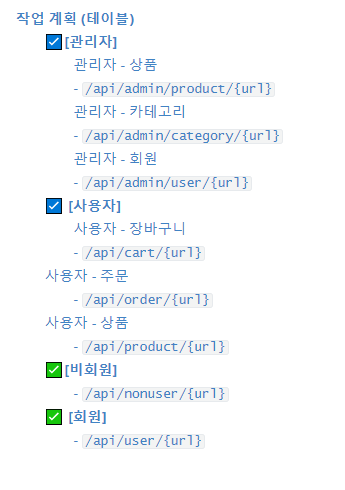

# 작업 계획 (테이블)

### [목차]

---

 

------

## :ballot_box_with_check:**​[관리자]**

### 관리자 - 상품

### - `/api/admin/product/{url}`

| API목록             | url                            | 예상일정 | 예상소요시간 | 개발일정 | 개발시간   | 작업결과서                                                   |
| ------------------- | ------------------------------ | -------- | ------------ | -------- | ---------- | ------------------------------------------------------------ |
| 상품 등록           | /add                           | 07.21    | 5h (5시간)   | 07.21    | 4h(4시간)  | [보기](https://github.com/jungeunlee95/shopping-mall/wiki/상품등록) |
| 상품 상위 옵션 등록 | /addOption                     | 07.22    | 1h (1시간)   | 07.21    | 1h (1시간) | [보기](https://github.com/jungeunlee95/shopping-mall/wiki/상품상위옵션등록) |
| 상품 최종 옵션 등록 | /addProductOption              | 07.22    | 1h (1시간)   | 07.22    | 1h (1시간) | [보기](https://github.com/jungeunlee95/shopping-mall/wiki/상품최종옵션등록) |
| 상품 옵션 수정      | /modifyOptionValue/{productNo} | 07.22    | 1h (1시간)   | 07.22    | 1h (1시간) | [보기](https://github.com/jungeunlee95/shopping-mall/wiki/상품옵션수정) |
| 상품 삭제           | /delete/{no}                   | 07.22    | 1h (1시간)   | 07.22    | 1h (1시간) | [보기](https://github.com/jungeunlee95/shopping-mall/wiki/상품삭제) |
| 상품 수정           | /modify                        | 07.22    | 1h (1시간)   | 07.22    | 1h (1시간) | [보기](https://github.com/jungeunlee95/shopping-mall/wiki/상품수정) |

 

### 관리자 - 카테고리

### - `/api/admin/category/{url}`

| API목록                      | url           | 예상일정 | 예상소요시간 | 개발일정 | 개발시간   | 작업결과서 |
| ---------------------------- | ------------- | -------- | ------------ | -------- | ---------- | ---------- |
| 상위 카테고리 등록           | /add          | 07.18    | 1h (1시간)   | 07.18    | 1h (1시간) |            |
| 하위 카테고리 등록           | /addLow       | 07.18    | 1h (1시간)   | 07.18    | 1h (1시간) |            |
| 상위 카테고리 이름 중복 검사 | /checkName    | 07.18    | 1h (1시간)   | 07.18    | 30m (30분) |            |
| 하위 카테고리 이름 중복 검사 | /checkLowName | 07.19    | 1h (1시간)   | 07.18    | 30m (30분) |            |
| 카테고리 삭제                | /delete       | 07.19    | 1h (1시간)   | 07.19    | 30m (30분) |            |
| 카테고리 목록 가져오기       | /list         | 07.19    | 1h (1시간)   | 07.19    | 30m (30분) |            |
| 카테고리 수정                | /modify       | 07.19    | 1h (1시간)   | 07.19    | 30m (30분) |            |

 

### 관리자 - 회원

### - `/api/admin/user/{url}`

| API목록        | url     | 예상일정 | 예상소요시간 | 개발일정 | 개발시간 | 작업결과서 |
| -------------- | ------- | -------- | ------------ | -------- | -------- | ---------- |
| 회원 목록      | /list   | 07.27    |              |          |          |            |
| 회원 정보 수정 | /modify | 07.27    |              |          |          |            |
| 회원 삭제      | /delete | 07.27    |              |          |          |            |

------

 

------

## :ballot_box_with_check: **[사용자]**

### 사용자 - 장바구니

### - `/api/cart/{url}`

| API목록                | url      | 예상일정 | 예상소요시간 | 개발일정 | 개발시간 | 작업결과서 |
| ---------------------- | -------- | -------- | ------------ | -------- | -------- | ---------- |
| 장바구니 상품 추가     | /add     | 07.23    |              |          |          |            |
| 장바구니 상품 삭제     | /delete  | 07.23    |              |          |          |            |
| 장바구니 목록 가져오기 | /getList | 07.23    |              |          |          |            |

 

## 사용자 - 주문

### - `/api/order/{url}`

| API목록             | url          | 예상일정 | 예상소요시간 | 개발일정 | 개발시간 | 작업결과서 |
| ------------------- | ------------ | -------- | ------------ | -------- | -------- | ---------- |
| 회원 주문           | /add         | 07.24    |              |          |          |            |
| 회원 주문 목록      | /list        | 07.24    |              |          |          |            |
| 회원 주문 상세 목록 | /detail/{no} | 07.24    |              |          |          |            |

 

## 사용자 - 상품

### - `/api/product/{url}`

| API목록                                              | url                             | 예상일정 | 예상소요시간 | 개발일정 | 개발시간 | 작업결과서 |
| ---------------------------------------------------- | ------------------------------- | -------- | ------------ | -------- | -------- | ---------- |
| 상품 상세 정보                                       | /detail/{productNo}             | 07.20    |              |          |          |            |
| 상품 하위 옵션 가져오기                              | /getlowoption/{productNo}       | 07.20    |              |          |          |            |
| 특정 조건(카테고리, 검색어)에  맞는 상품 가져오기 | /{categoryNo}?keyword={keyword} | 07.20    |              |          |          |            |

## :white_check_mark:**​[비회원]**

### - `/api/nonuser/{url}`

| API목록                     | url                 | 예상일정 | 예상소요시간 | 개발일정 | 개발시간   | 작업결과서                                                   |
| --------------------------- | ------------------- | -------- | ------------ | -------- | ---------- | ------------------------------------------------------------ |
| 회원가입 API                | /join               | 07.16    | 2h (2시간)   | 07.16    | 2h         | [보기](https://github.com/jungeunlee95/shopping-mall/wiki/회원가입) |
| 아이디 중복 검사            | /checkId            | 07.16    | 1h (1시간)   | 07.16    | 1h         | [보기](https://github.com/jungeunlee95/shopping-mall/wiki/아이디중복검사) |
| 아이디 찾기                 | /findId             | 07.16    | 1h (1시간)   | 07.16    | 1h         | [보기](https://github.com/jungeunlee95/shopping-mall/wiki/아이디찾기) |
| 로그인 API                  | /login              | 07.16    | 1h (1시간)   | 07.16    | 1h         | [보기](https://github.com/jungeunlee95/shopping-mall/wiki/로그인) |
|                          |                     |          |              |          |            |                                                              |
| 장바구니 상품 추가          | /cart/add           | 07.25    | 1h (1시간)   | 07.25    | 2h (2시간) | [보기](https://github.com/jungeunlee95/shopping-mall/wiki/회원장바구니상품추가) |
| 장바구니 상품 삭제          | /cart/delete        | 07.25    | 1h (1시간)   | 07.25    | 30m (30분) | [보기](https://github.com/jungeunlee95/shopping-mall/wiki/장바구니상품삭제) |
| 장바구니 목록 가져오기      | /cart/getList       | 07.25    | 1h (1시간)   | 07.25    | 30m (30분) | [보기](https://github.com/jungeunlee95/shopping-mall/wiki/장바구니-목록) |
| 장바구니 상품 옵션 가져오기 | /cart/getOptionList | 07.25    | 1h (1시간)   | 07.25    | 30m (30분) | [보기](https://github.com/jungeunlee95/shopping-mall/wiki/장바구니상품옵션가져오기) |
|                         |                     |          |              |          |            |                                                              |
| 비회원 주문하기             | /order/add          | 07.26    | 3h (3시간)   | 07.26    | 4h (4시간) | [보기](https://github.com/jungeunlee95/shopping-mall/wiki/비회원주문하기) |
| 비회원 주문 목록            | /order/list         | 07.26    | 1h (1시간)   | 07.27    | 1h (1시간) | [보기](https://github.com/jungeunlee95/shopping-mall/wiki/비회원-주문목록) |
| 비회원 주문 상세 목록       | /order/detail/{no}  | 07.26    | 1h (1시간)   | 07.27    | 1h (1시간) | [보기](https://github.com/jungeunlee95/shopping-mall/wiki/비회원주문상세목록) |

---

 

---

## :white_check_mark: **[회원]**

### - `/api/user/{url}`

| API목록                     | url             | 예상일정 | 예상소요시간 | 개발일정 | 개발시간    | 작업결과서                                                   |
| --------------------------- | --------------- | -------- | ------------ | -------- | ----------- | ------------------------------------------------------------ |
| 회원 정보 수정              | /modify         | 07.17    | 1h (1시간)   | 07.17    | 2h          | [보기](https://github.com/jungeunlee95/shopping-mall/wiki/회원정보수정) |
| 회원 탈퇴                   | /deleteUser     | 07.17    | 1h (1시간)   | 07.17    | 30h         | [보기](https://github.com/jungeunlee95/shopping-mall/wiki/회원탈퇴) |
|                          |                 |          |              |          |             |                                                              |
| 회원 주소지 등록            | /addAddress     | 07.17    | 1h(1시간)    | 07.17    | 1h(1시간)   | [보기](https://github.com/jungeunlee95/shopping-mall/wiki/회원주소지등록) |
| 회원 주소지 리스트 가져오기 | /getAddressList | 07.17    | 30h(30시간)  | 07.17    | 30h(30시간) | [보기](https://github.com/jungeunlee95/shopping-mall/wiki/회원주소지리스트) |
| 회원 주소지 하나 가져오기   | /getAddress     | 07.17    | 30h(30시간)  | 07.17    | 30h(30시간) | [보기](https://github.com/jungeunlee95/shopping-mall/wiki/회원주소지선택) |
| 회원 주소지 삭제하기        | /deleteAddress  | 07.17    | 30h(30시간)  | 07.17    | 30h(30시간) | [보기](https://github.com/jungeunlee95/shopping-mall/wiki/회원주소지삭제) |

---

 