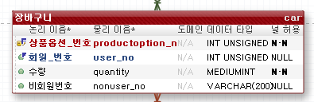

작업 계획 (테이블)

# TODO LIST

- user table role 추가하기
- mall_id 테이블 만들기
- 모든 컬럼에 mall_id 추가하기
- 상품 등록, 옵션 등록 합치기


---

## [회원]

###  - `/api/user/{url}`

| API목록            | url       | 예상일정 | 예상소요시간 | 개발일정 | 개발시간 | 작업결과서                                                   |
| ------------------ | --------- | -------- | ------------ | -------- | -------- | ------------------------------------------------------------ |
| 로그인 API         | /login    | 07.16    | 1h (1시간)   | 07.16    | 1h       | [보기](https://github.com/jungeunlee95/shopping-mall/wiki/로그인) |
| 회원가입 API       | /join     | 07.16    | 2h (2시간)   | 07.16    | 2h       | [보기](https://github.com/jungeunlee95/shopping-mall/wiki/회원가입) |
| 아이디 중복 검사   | /checkId  | 07.16    | 1h (1시간)   | 07.16    | 1h       | [보기](https://github.com/jungeunlee95/shopping-mall/wiki/아이디중복검사) |
| 아이디 찾기        | /findId   | 07.16    | 1h (1시간)   | 07.16    | 1h       | [보기](https://github.com/jungeunlee95/shopping-mall/wiki/아이디찾기) |
| 회원리스트(관리자) | /userList | 07.16    | 1h (1시간)   | 07.16    | 30m      | ->관리자로 옮기기                                            |
| 회원정보수정       | /modify   | 07.17    | 1h (1시간)   | 07.17    | 2h       | [보기](https://github.com/jungeunlee95/shopping-mall/wiki/회원정보수정) |
| 회원삭제(탈퇴)     | /delete   | 07.17    | 1h (1시간)   | 07.17    | 30h      | ->관리자로 옮기기                                            |

<br>

## [카테고리]

### - `/api/admin/category/{url}`

| API목록                | url                    | 예상일정 | 예상소요시간 | 개발일정 | 개발시간 | 작업결과서 |
| ---------------------- | ---------------------- | -------- | ------------ | -------- | -------- | ---------- |
| 상위카테고리 중복 검사 | /checkName?name={name} | 07.18    | 1h           | 07.18    | 2h       |            |
| 하위카테고리 중복 검사 | /checkLowName          | 07.18    | 30m          | 07.18    | 1h       |            |
| 상위 카테고리 등록     | /add                   | 07.18    | 1h           | 07.18    | 30m      |            |
| 하위 카테고리 등록     | /addLow                | 07.18    | 30m          | 07.18    | 30m      |            |
| 카테고리 수정          | /modify                | 07.18    | 30m          | 07.18    | 30m      |            |
| 카테고리 삭제          | /delete?no={no}        | 07.18    | 30m          | 07.18    | 30m      |            |
| 카테고리 목록          | /list                  | 07.18    | 1h           | 07.18    | 1h       |            |

<br>

## [상품]

### - `/api/admin/product/{url}`

| API목록                                                 | url                            | 예상일정 | 예상소요시간 | 개발일정 | 개발시간 | 작업결과서                                                   |
| ------------------------------------------------------- | ------------------------------ | -------- | ------------ | -------- | -------- | ------------------------------------------------------------ |
| 상품등록                                                | /add                           | 07.19    | 2h           | 07.19    | 4h       | [보기](https://github.com/jungeunlee95/shopping-mall/wiki/상품등록) |
| 상품 상위 옵션 등록                                     | /addOption                     | 07.19    | 1h           | 07.19    | 2h       |                                                              |
| 상품 수정                                               | /modify                        | 07.22    |              |          |          |                                                              |
| 상품 삭제                                               | /delete/{no}                   | 07.22    |              |          |          |                                                              |
| 최종 상품 옵션 등록                                     | /addProductOption              |          |              |          |          |                                                              |
| 상품 옵션 값 수정(상품 옵션 가져와서 보여주고 수정하기) | /modifyOptionValue/{productNo} |          |              |          |          |                                                              |
| 상품 최종 옵션 수정(전체 delete하고 다시 insert)        | `/addProductOption` 에서 처리  |          |              |          |          |                                                              |

### - `/api/product/{url}`

> todo : 상품목록 합치기

| API목록                        | url                       | 예상일정 | 예상소요시간 | 개발일정 | 개발시간 | 작업결과서 |
| ------------------------------ | ------------------------- | -------- | ------------ | -------- | -------- | ---------- |
| 상품 목록                      | /                         | 07.22    |              |          |          |            |
| 검색어&카테고리 조건 상품 목록 | /{categoryNo}             | 07.23    |              |          |          |            |
| 상품 상세정보                  | /detail/{productNo}       | 07.23    |              |          |          |            |
| 상품 옵션 값 가져오기          | /getlowoption/{productNo} |          |              |          |          |            |

<br>

## [장바구니] 

### - `/api/cart/{url}`

테이블 수정




장바구니에 추가할 때

: 상품옵션번호, 회원번호, 수량

장바구니 가져올 것

: 상품 번호, 상품 이름, 상품 옵션, 상품 수량, 가격

| API목록       | url                         | 예상일정 | 예상소요시간 | 개발일정 | 개발시간 | 작업결과서 |
| ------------- | --------------------------- | -------- | ------------ | -------- | -------- | ---------- |
| 장바구니 추가 | /{userNo}/{productOptionNo} |          |              |          |          |            |
| 장바구니 수정 | /modify/{userId}/{cartNo}   |          |              |          |          |            |
| 장바구니 삭제 | /delete/{userId}/{cartNo}   |          |              |          |          |            |
| 장바구니 목록 | /{userId}                   |          |              |          |          |            |


### [주문] 

### - `/api/order/{url}`

| API목록 | url  | 예상일정 | 예상소요시간 | 개발일정 | 개발시간 | 작업결과서 |
| ------- | ---- | -------- | ------------ | -------- | -------- | ---------- |
|         |      |          |              |          |          |            |
|         |      |          |              |          |          |            |

### - `/api/admin/order/{url}`

| API목록 | url  | 예상일정 | 예상소요시간 | 개발일정 | 개발시간 | 작업결과서 |
| ------- | ---- | -------- | ------------ | -------- | -------- | ---------- |
|         |      |          |              |          |          |            |
|         |      |          |              |          |          |            |


```sql
CREATE TABLE `CART` (
	`user_no`  int default null COMMENT '회원번호', -- 회원번호
	`product_no` int NOT NULL COMMENT '상품번호', -- 상품번호
	`nonuser_no` int default null COMMENT '비회원번호', -- 비회원번호
	`quantity` int NOT NULL COMMENT '수량' -- 수량
)
COMMENT '장바구니';

-- 장바구니
ALTER TABLE `CART`
	ADD CONSTRAINT `PK_TABLE` -- 장바구니 기본키
		PRIMARY KEY (
			`user_no`,  -- 회원번호
			`product_no`, -- 상품번호
			`nonuser_no`  -- 비회원번호
		);
```


