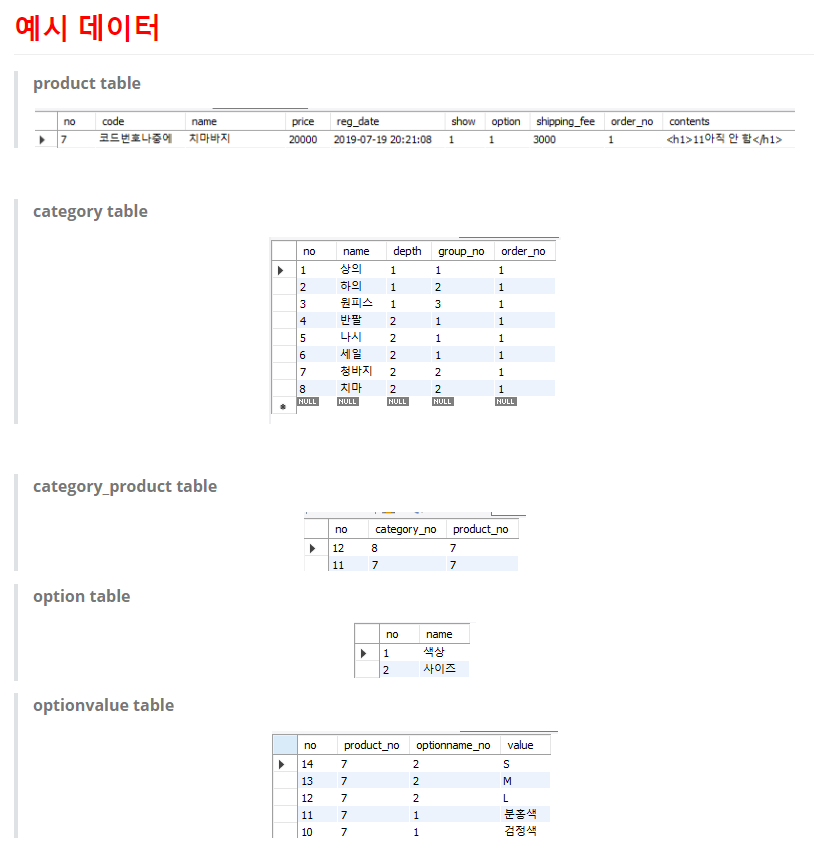

## 작업 계획 (테이블)

서비스 나누기 - 카테고리, 상품, 주문, 장바구니

### [회원] - `/api/user/{url}`

| API목록          | url       | 예상일정 | 예상소요시간 | 개발일정 | 개발시간 | 작업결과서 |
| ---------------- | --------- | -------- | ------------ | -------- | -------- | ---------- |
| 로그인 API       | /login    | 07.16    | 1h (1시간)   | 07.16    | 1h       |            |
| 회원가입 API     | /join     | 07.16    | 2h (2시간)   | 07.16    | 2h       |            |
| 아이디 중복 검사 | /checkId  | 07.16    | 1h (1시간)   | 07.16    | 1h       |            |
| 아이디 찾기      | /findId   | 07.16    | 1h (1시간)   | 07.16    | 1h       |            |
| 회원리스트       | /userList | 07.16    | 1h (1시간)   | 07.16    | 30m      |            |
| 회원정보수정     | /modify   | 07.17    | 1h (1시간)   | 07.17    | 2h       | 오류해결   |
| 회원삭제(탈퇴)   | /delete   | 07.17    | 1h (1시간)   | 07.17    | 30h      |            |

 

### [카테고리] - `/api/admin/category/{url}`

| API목록                | url                                       | 예상일정 | 예상소요시간 | 개발일정 | 개발시간 | 작업결과서 |
| ---------------------- | ----------------------------------------- | -------- | ------------ | -------- | -------- | ---------- |
| 상위카테고리 중복 검사 | /api/admin/category/checkName?name={name} | 07.18    | 1h           | 07.18    | 2h       |            |
| 하위카테고리 중복 검사 | /api/admin/category/checkLowName          | 07.18    | 30m          | 07.18    | 1h       |            |
| 상위 카테고리 등록     | /api/admin/category/add                   | 07.18    | 1h           | 07.18    | 30m      |            |
| 하위 카테고리 등록     | /api/admin/category/addLow                | 07.18    | 30m          | 07.18    | 30m      |            |
| 카테고리 수정          | /api/admin/category/modify                | 07.18    | 30m          | 07.18    | 30m      |            |
| 카테고리 삭제          | /api/admin/category/delete?no={no}        | 07.18    | 30m          | 07.18    | 30m      |            |
| 카테고리 목록          | /api/admin/category/list                  | 07.18    | 1h           | 07.18    | 1h       |            |

 

### [상품] - `/api/product/{url}`

상품 등록할 때

-> 카테고리 수 만큼 등록 (category에서 존재하는 카테고리 목록 가져오고 그중에 선택한 것 만큼 -> 상품 먼저 등록 후 -> insetkey가져와서 -> category_product에 등록)

->  옵션여부 false인 경우 -> 바로 상품 등록 

-> 옵션여부 true인 경우 -> 

> - 옵션 이름 -> optionname table 순회 후 있으면 그 번호 가져오고 없으면 insert후 그 번호 가져오기
> - 옵션 이름 번호 가져오면 상품 번호와 함께, 날라온 세트 옵션 값 등록(1(색상)번일 경우) -> 같은 세트인 검정, 파랑을 option테이블에 insert

| API목록             | url                          | 예상일정 | 예상소요시간 | 개발일정 | 개발시간 | 작업결과서                                                   |
| ------------------- | ---------------------------- | -------- | ------------ | -------- | -------- | ------------------------------------------------------------ |
| 상품등록            | /api/admin/product/add       | 07.19    | 2h           | 07.19    | 4h       | [보기](https://github.com/jungeunlee95/shopping-mall/wiki/%EC%83%81%ED%92%88%EB%93%B1%EB%A1%9D-%EC%9E%91%EC%97%85%EA%B2%B0%EA%B3%BC%EC%84%9C) |
| 상품 상위 옵션 등록 | /api/admin/product/addOption | 07.19    | 1h           | 07.19    | 2h       |                                                              |
|                     |                              |          |              |          |          |                                                              |
|                     |                              |          |              |          |          |                                                              |
|                     |                              |          |              |          |          |                                                              |
|                     |                              |          |              |          |          |                                                              |
|                     |                              |          |              |          |          |                                                              |
|                     |                              |          |              |          |          |                                                              |

 

### [장바구니] - `/api/cart/{url}`

| API목록 | url  | 예상일정 | 예상소요시간 | 개발일정 | 개발시간 | 작업결과서 |
| ------- | ---- | -------- | ------------ | -------- | -------- | ---------- |
|         |      |          |              |          |          |            |
|         |      |          |              |          |          |            |
|         |      |          |              |          |          |            |
|         |      |          |              |          |          |            |
|         |      |          |              |          |          |            |
|         |      |          |              |          |          |            |
|         |      |          |              |          |          |            |
|         |      |          |              |          |          |            |

### [관리자] - `/api/admin/{url}`

| API목록 | url  | 예상일정 | 예상소요시간 | 개발일정 | 개발시간 | 작업결과서 |
| ------- | ---- | -------- | ------------ | -------- | -------- | ---------- |
|         |      |          |              |          |          |            |
|         |      |          |              |          |          |            |
|         |      |          |              |          |          |            |
|         |      |          |              |          |          |            |
|         |      |          |              |          |          |            |
|         |      |          |              |          |          |            |
|         |      |          |              |          |          |            |
|         |      |          |              |          |          |            |

---

---

<API 작업 결과 양식 - API 별>

로그인 API (/login/xxxx/xxxxx) 
■ request: 
   post 
     params: 
       user_id = 사용자ID 
       user_pwd = 사용자 비밀번호  
       client_ip = 사용자 접근 IP 

■ response: 
     200: 성공 
       xxxxx 
     400: 실패 
       case1. 사용자ID 형식 오류 
       case2. 사용자ID 값 없음 
       xxxxx 

■ 실제동작코드 
a.java 
  <java code> 

b.java 
  <java code> 

■ TC CODE 

 <tc code>

