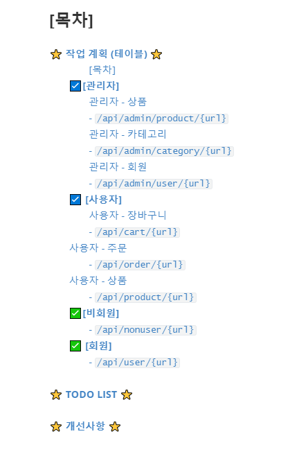

# :star: ​작업 계획 (테이블) :star:

### 

---

<br>

------

## :ballot_box_with_check:**​[관리자]**

### 관리자 - 상품

### - `/api/admin/product/{url}`

| API목록             | url                            | 예상일정 | 예상소요시간 | 개발일정 | 개발시간   | 작업결과서                                                   |
| ------------------- | ------------------------------ | -------- | ------------ | -------- | ---------- | ------------------------------------------------------------ |
| 상품 등록           | /add                           | 07.21    | 5h (5시간)   | 07.21    | 5h(5시간)  | [보기](https://github.com/jungeunlee95/shopping-mall/wiki/상품등록) |
| 상품 상위 옵션 등록 | /addOption                     | 07.22    | 2h (1시간)   | 07.22    | 1h (1시간) | [보기](https://github.com/jungeunlee95/shopping-mall/wiki/상품상위옵션등록) |
| 상품 최종 옵션 등록 | /addProductOption              | 07.22    | 2h (1시간)   | 07.22    | 1h (1시간) | [보기](https://github.com/jungeunlee95/shopping-mall/wiki/상품최종옵션등록) |
| 상품 옵션 수정      | /modifyOptionValue/{productNo} | 07.22    | 1h (1시간)   | 07.22    | 1h (1시간) | [보기](https://github.com/jungeunlee95/shopping-mall/wiki/상품옵션수정) |
| 상품 삭제           | /delete/{no}                   | 07.22    | 1h (1시간)   | 07.22    | 1h (1시간) | [보기](https://github.com/jungeunlee95/shopping-mall/wiki/상품삭제) |
| 상품 수정           | /modify                        | 07.22    | 1h (1시간)   | 07.22    | 1h (1시간) | [보기](https://github.com/jungeunlee95/shopping-mall/wiki/상품수정) |

<br>

### 관리자 - 카테고리

### - `/api/admin/category/{url}`

| API목록                      | url           | 예상일정 | 예상소요시간 | 개발일정 | 개발시간   | 작업결과서                                                   |
| ---------------------------- | ------------- | -------- | ------------ | -------- | ---------- | ------------------------------------------------------------ |
| 상위 카테고리 등록           | /add          | 07.18    | 1h (1시간)   | 07.18    | 1h (1시간) | [보기](https://github.com/jungeunlee95/shopping-mall/wiki/상위카테고리등록) |
| 하위 카테고리 등록           | /addLow       | 07.18    | 1h (1시간)   | 07.18    | 1h (1시간) | [보기](https://github.com/jungeunlee95/shopping-mall/wiki/하위카테고리등록) |
| 상위 카테고리 이름 중복 검사 | /checkName    | 07.18    | 1h (1시간)   | 07.18    | 30m (30분) | [보기](https://github.com/jungeunlee95/shopping-mall/wiki/상위카테고리중복검사) |
| 하위 카테고리 이름 중복 검사 | /checkLowName | 07.19    | 1h (1시간)   | 07.18    | 30m (30분) | [보기](https://github.com/jungeunlee95/shopping-mall/wiki/하위카테고리중복검사) |
| 카테고리 삭제                | /delete       | 07.19    | 1h (1시간)   | 07.19    | 30m (30분) | [보기](https://github.com/jungeunlee95/shopping-mall/wiki/카테고리삭제) |
| 카테고리 목록 가져오기       | /list         | 07.19    | 1h (1시간)   | 07.19    | 30m (30분) | [보기](https://github.com/jungeunlee95/shopping-mall/wiki/카테고리목록) |
| 카테고리 수정                | /modify       | 07.19    | 1h (1시간)   | 07.19    | 30m (30분) | [보기](https://github.com/jungeunlee95/shopping-mall/wiki/카테고리수정) |

<br>

### 관리자 - 회원

### - `/api/admin/user/{url}`

| API목록        | url     | 예상일정 | 예상소요시간 | 개발일정 | 개발시간   | 작업결과서                                                   |
| -------------- | ------- | -------- | ------------ | -------- | ---------- | ------------------------------------------------------------ |
| 회원 목록      | /list   | 07.27    | 1h (1시간)   | 07.27    | 1h (1시간) | [보기](https://github.com/jungeunlee95/shopping-mall/wiki/회원목록) |
| 회원 정보 수정 | /modify | 07.27    | 1h (1시간)   | 07.27    | 1h (1시간) | [보기](https://github.com/jungeunlee95/shopping-mall/wiki/회원정보수정관리자) |
| 회원 삭제      | /delete | 07.27    | 1h (1시간)   | 07.27    | 1h (1시간) | [보기](https://github.com/jungeunlee95/shopping-mall/wiki/회원삭제관리자) |

------

<br>

------

## :ballot_box_with_check: **[사용자]**

### 사용자 - 장바구니

### - `/api/cart/{url}`

| API목록                | url      | 예상일정 | 예상소요시간 | 개발일정 | 개발시간   | 작업결과서                                                   |
| ---------------------- | -------- | -------- | ------------ | -------- | ---------- | ------------------------------------------------------------ |
| 장바구니 상품 추가     | /add     | 07.23    | 2h (2시간)   | 07.23    | 2h (2시간) | [보기](https://github.com/jungeunlee95/shopping-mall/wiki/회원장바구니상품추가) |
| 장바구니 상품 삭제     | /delete  | 07.23    | 1h (1시간)   | 07.23    | 1h 1시간)  | [보기](https://github.com/jungeunlee95/shopping-mall/wiki/회원장바구니상품삭제) |
| 장바구니 목록 가져오기 | /getList | 07.23    | 1h (1시간)   | 07.23    | 1h 1시간)  | [보기](https://github.com/jungeunlee95/shopping-mall/wiki/회원장바구니목록가져오기) |

<br>

## 사용자 - 주문

### - `/api/order/{url}`

| API목록             | url          | 예상일정 | 예상소요시간 | 개발일정 | 개발시간   | 작업결과서                                                   |
| ------------------- | ------------ | -------- | ------------ | -------- | ---------- | ------------------------------------------------------------ |
| 회원 주문           | /add         | 07.26    | 5h (5시간)   | 07.26    | 5h (5시간) | [보기](https://github.com/jungeunlee95/shopping-mall/wiki/회원주문하기) |
| 회원 주문 목록      | /list        | 07.27    | 5h (5시간)   | 07.27    | 4h (4시간) | [보기](https://github.com/jungeunlee95/shopping-mall/wiki/회원주문목록) |
| 회원 주문 상세 목록 | /detail/{no} | 07.28    | 5h (5시간)   | 07.28    | 4h 4시간)  | [보기](https://github.com/jungeunlee95/shopping-mall/wiki/회원주문상세목록) |

<br>

## 사용자 - 상품

### - `/api/product/{url}`

| API목록                                                   | url                             | 예상일정 | 예상소요시간 | 개발일정 | 개발시간   | 작업결과서                                                   |
| --------------------------------------------------------- | ------------------------------- | -------- | ------------ | -------- | ---------- | ------------------------------------------------------------ |
| 상품 상세 정보                                            | /detail/{productNo}             | 07.20    | 5h (5시간)   | 07.20    | 4h (4시간) | [보기](https://github.com/jungeunlee95/shopping-mall/wiki/상품상세정보) |
| 상품 하위 옵션 가져오기                                   | /getlowoption/{productNo}       | 07.21    | 5h (5시간)   | 07.20    | 3h (3시간) | [보기](https://github.com/jungeunlee95/shopping-mall/wiki/상품하위옵션가져오기) |
| 특정 조건(카테고리, 검색어)에<br> 맞는 상품 목록 가져오기 | /{categoryNo}?keyword={keyword} | 07.22    | 5h (5시간)   | 07.20    | 3h (3시간) | [보기](https://github.com/jungeunlee95/shopping-mall/wiki/상품목록가져오기) |


## :white_check_mark:**​[비회원]**

### - `/api/nonuser/{url}`

| API목록                     | url                 | 예상일정 | 예상소요시간 | 개발일정 | 개발시간   | 작업결과서                                                   |
| --------------------------- | ------------------- | -------- | ------------ | -------- | ---------- | ------------------------------------------------------------ |
| 회원가입 API                | /join               | 07.16    | 2h (2시간)   | 07.16    | 2h         | [보기](https://github.com/jungeunlee95/shopping-mall/wiki/회원가입) |
| 아이디 중복 검사            | /checkId            | 07.16    | 1h (1시간)   | 07.16    | 1h         | [보기](https://github.com/jungeunlee95/shopping-mall/wiki/아이디중복검사) |
| 아이디 찾기                 | /findId             | 07.16    | 1h (1시간)   | 07.16    | 1h         | [보기](https://github.com/jungeunlee95/shopping-mall/wiki/아이디찾기) |
| 로그인 API                  | /login              | 07.16    | 1h (1시간)   | 07.16    | 1h         | [보기](https://github.com/jungeunlee95/shopping-mall/wiki/로그인) |
| <br>                        |                     |          |              |          |            |                                                              |
| 장바구니 상품 추가          | /cart/add           | 07.25    | 1h (1시간)   | 07.25    | 2h (2시간) | [보기](https://github.com/jungeunlee95/shopping-mall/wiki/비회원장바구니상품추가) |
| 장바구니 상품 삭제          | /cart/delete        | 07.25    | 1h (1시간)   | 07.25    | 30m (30분) | [보기](https://github.com/jungeunlee95/shopping-mall/wiki/장바구니상품삭제) |
| 장바구니 목록 가져오기      | /cart/getList       | 07.25    | 1h (1시간)   | 07.25    | 30m (30분) | [보기](https://github.com/jungeunlee95/shopping-mall/wiki/장바구니-목록) |
| 장바구니 상품 옵션 가져오기 | /cart/getOptionList | 07.25    | 1h (1시간)   | 07.25    | 30m (30분) | [보기](https://github.com/jungeunlee95/shopping-mall/wiki/장바구니상품옵션가져오기) |
| <br/>                       |                     |          |              |          |            |                                                              |
| 비회원 주문하기             | /order/add          | 07.28    | 5h (5시간)   | 07.26    | 4h (4시간) | [보기](https://github.com/jungeunlee95/shopping-mall/wiki/비회원주문하기) |
| 비회원 주문 목록            | /order/list         | 07.29    | 5h (5시간)   | 07.27    | 3h (1시간) | [보기](https://github.com/jungeunlee95/shopping-mall/wiki/비회원-주문목록) |
| 비회원 주문 상세 목록       | /order/detail/{no}  | 07.29    | 5h (5시간)   | 07.27    | 3h (1시간) | [보기](https://github.com/jungeunlee95/shopping-mall/wiki/비회원주문상세목록) |

---

<br>

---

## :white_check_mark: **[회원]**

### - `/api/user/{url}`

| API목록                     | url             | 예상일정 | 예상소요시간 | 개발일정 | 개발시간    | 작업결과서                                                   |
| --------------------------- | --------------- | -------- | ------------ | -------- | ----------- | ------------------------------------------------------------ |
| 회원 정보 수정              | /modify         | 07.17    | 1h (1시간)   | 07.17    | 2h          | [보기](https://github.com/jungeunlee95/shopping-mall/wiki/회원정보수정) |
| 회원 탈퇴                   | /deleteUser     | 07.17    | 1h (1시간)   | 07.17    | 30h         | [보기](https://github.com/jungeunlee95/shopping-mall/wiki/회원탈퇴) |
| <br>                        |                 |          |              |          |             |                                                              |
| 회원 주소지 등록            | /addAddress     | 07.17    | 1h(1시간)    | 07.17    | 1h(1시간)   | [보기](https://github.com/jungeunlee95/shopping-mall/wiki/회원주소지등록) |
| 회원 주소지 리스트 가져오기 | /getAddressList | 07.17    | 30h(30시간)  | 07.17    | 30h(30시간) | [보기](https://github.com/jungeunlee95/shopping-mall/wiki/회원주소지리스트) |
| 회원 주소지 하나 가져오기   | /getAddress     | 07.17    | 30h(30시간)  | 07.17    | 30h(30시간) | [보기](https://github.com/jungeunlee95/shopping-mall/wiki/회원주소지선택) |
| 회원 주소지 삭제하기        | /deleteAddress  | 07.17    | 30h(30시간)  | 07.17    | 30h(30시간) | [보기](https://github.com/jungeunlee95/shopping-mall/wiki/회원주소지삭제) |

---

<br>

# 

# :star: TODO LIST :star:

- **보안(Spring Security)과 인증(Oauth2) 적용하기**

  > - api를 집중해서 만들며 보안과 인증 절차를 적용하지 않았다.
  >
  > - 관리자의 경우 `/admin/**` url에 `ROLE_AMDIN` 권한을 적용해야 한다.
  >
  > - 비회원의 경우(**장바구니, 주문, 상품조회 등의 기능을 NonUserController에 몰아 넣었다.**) `/nonuser/**`url의 권한을 모두 허용해야한다. 
  >
  >   > ex) `antMatch("/nonuser**").permitAll()`
  >
  >   > -> 효율적인 방법인지 깊게 고려해보지 못했지만, 비회원에게 모든 권한을 열어주기 위해서 비회원컨트롤러에 권한을 필요로하지 않는 기능을 몰아넣었다.
  >
  > - 그 외의 모든 url은 `ROLE_USER` 권한을 필요로 한다.

  <br>

- **카테고리 테이블 수정하기** 

  > 현재 카테고리가 1개의 테이블로 구성이 되어있다. 
  >
  > 하지만 카테고리 수정과 확장성을 고려 했을 때, 카테고리 테이블을 2개로 나누는 것이 좋을 것 같다.
  >
  > ex) 아래와 같은 형식으로 카테고리 테이블을 나누는 것이 좋을 것 같다.
  >
  > ```sql
  > CREATE TABLE category (
  >     category_no INTEGER NOT NULL,
  >     category_name VARCHAR(100) NOT NULL
  >     CONSTRAINT pk_category PRIMARY KEY (category_no)
  > );
  > 
  > CREATE TABLE t_category_tree (
  >     tree_type CHAR(1) NOT NULL,
  >     category_no INTEGER NOT NULL,
  >     parent_category_no INTEGER NOT NULL,
  >     sort_no INTEGER NOT NULL,
  >     depth_no INTEGER NOT NULL,
  >     category_name_for_tree VARCHAR(100) NULL,
  >     CONSTRAINT pk_category_tree PRIMARY KEY (tree_type, category_no, parent_category_no)
  > );
  > ```

<br>

- mall_id 테이블 만들기

- 모든 컬럼에 mall_id 추가하기

  > 멀티 쇼핑몰 확장성을 고려해서 쇼핑몰을 구분할 수 있는 mall_id테이블을 만들고,
  >
  > 모든 테이블 컬럼에 mall_id를 추가하는 것이 좋을 것 같다.
  >
  > 아직 보안과 인증을 적용하지 않았지만 Security를 적용할 계획이기 때문에 mall_id를 추가해 client_id로 활용하는 것도 좋은 방법이라 생각한다.

<br>

- 이미지 업로드 (대표사진), Contents(HTML 편집기)

  > 아직 상품의 이미지를 넣는 기능을 하지 않았다. -> 프론트엔드와 함께 다시 구현할 예정

<br>

- user table role 수정 => ROLE_USER, ROLE_ADMIN

  > 현재 table에 데이터가 `enum('U', 'A')` 형식으로 들어간다. 
  >
  > 이를 씨큐리티 적용을 고려하여 `enum('ROLE_USER', 'ROLE_ADMIN')` 로 수정해야한다.

<br>

- db예외처리 -> 트랜잭션으로 처리하기

<br>

# 

# :star: 개선사항 :star:

- **비회원 컨트롤러 -> 비회원 기능 나누기**

  > 나중에 시큐리티  적용하고 `antMatch("/nonuser**").permitAll()` 이런식으로 나누기위해, 기존에 기능별로(장바구니 -CartController, 주문-OrderController 등..) 나누었던 URL을, 로그인하지 않아도 사용할 수 있도록 `NonUserController`로 넣었다.

- **상품 등록, 옵션 등록 합치기**

  > 원래 상품 등록을 View에서 버튼을 누를 때 마다 ajax통신으로 하나씩 해결할 생각이였다. 
  >
  > 하지만, 상품 등록을 누른 순간 `/product/add` url로 한번만 통신을 하여 Service단에서 한번에 받은 데이터들을 처리했다.

- **주문시 재고 확인, 결제됐는지 확인 -> 어떤 제품이 재고가 없는지 확인** && 트랜젝션 고려하기

  > 주문 시 재고를 고려하지않고 바로 주문 테이블에 insert를 했었다.
  >
  > 주문 시 재고를 체크하는 옵션인지 고려한 뒤, 재고를 체크해야하는 경우 주문 재고보다 장바구니 재고가 더 많은지 확인한다.
  >
  > 고려 해야 할 것 :  여러 사람이 동시에 주문할 경우 트랜잭션을 어떻게 처리해야할지 고려해보아야한다.
  >
  > -> 생각한 방안 : 주문을하는 경우 해당 url의 서비스 로직에 LOCK을 걸어 첫번째 사용자가 결제완료가 되기까지 다른 사용자가 주문할 수 없도록 한다.  

- ~~**주문시 장바구니 비우기**~~

- **~~발리데이션 추가하기 ( 커스텀 )~~**

- 파라미터 받기 형식 수정하기 (파람, 패스배리어블)

  > 일관성 없는 형식으로 파라미터를 마구잡이로 받았었는데, 이를 나름 일관성 있게 수정하였다.


