[TOC]

시연은 동영상으로 하고 PPT로 발표

- 설계 및 분석
- 수행일정 + 고민
- 결과물
- 시연 모습 + 회고

---

설계 

## 초반 :

### usecase

초반 설계는 그냥 usecase로 어떤 기능을 넣을 것인지 먼저 대강 짜고

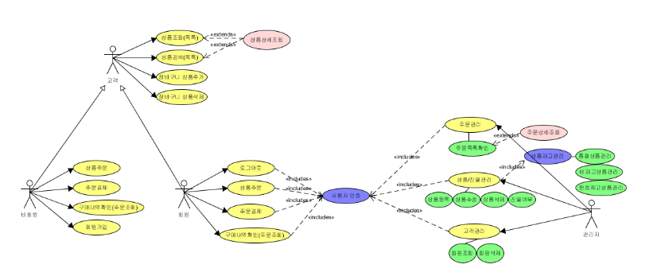


### storyboard

사용자 스토리보드를 통해 기능 정리함과 동시에 나중에 프론트엔드에 넣을 기능들도 미리 만들었다.

처음 써봤는데 나중에 개발할때 큰 도움이 됐었어서 추천. 

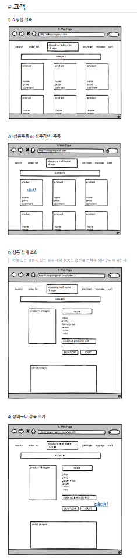

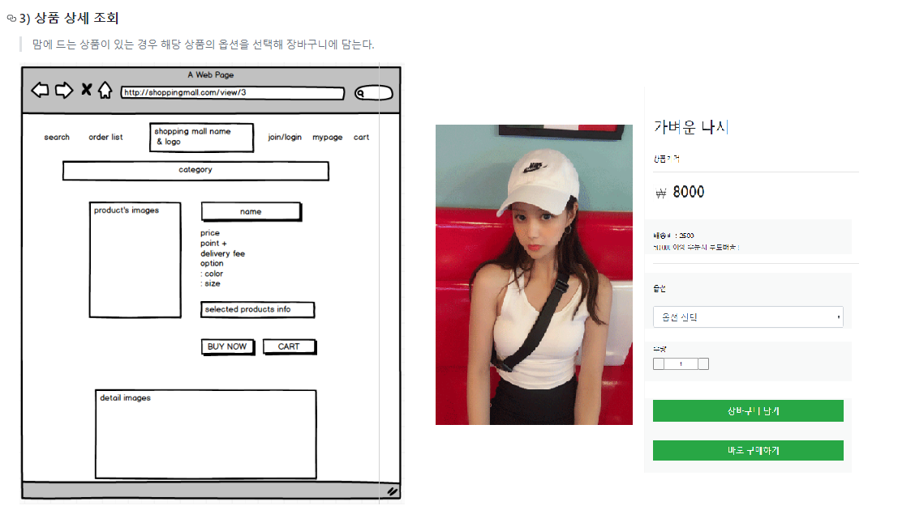

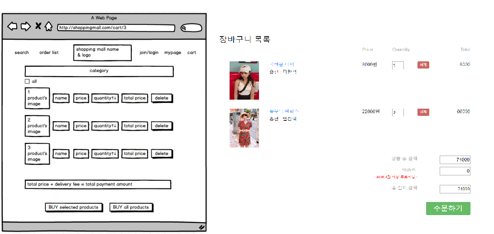

### 시퀀스

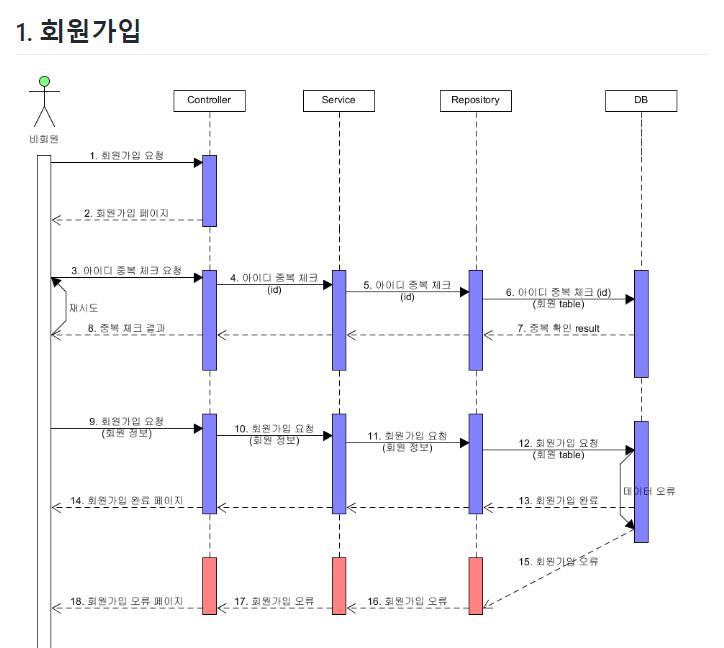

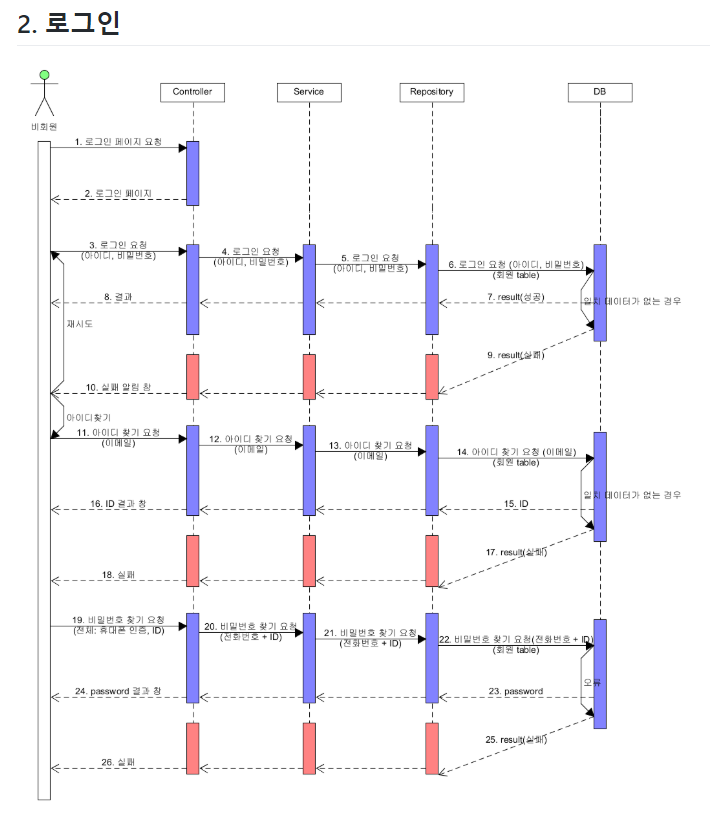

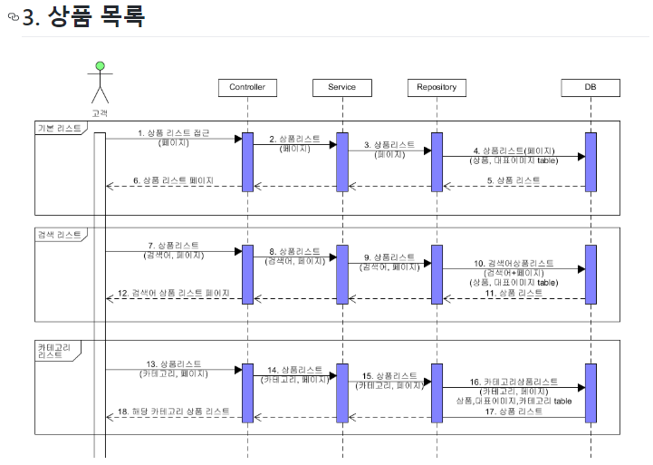

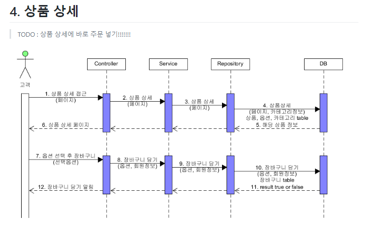

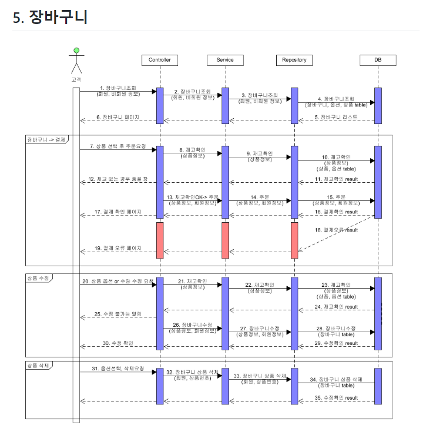

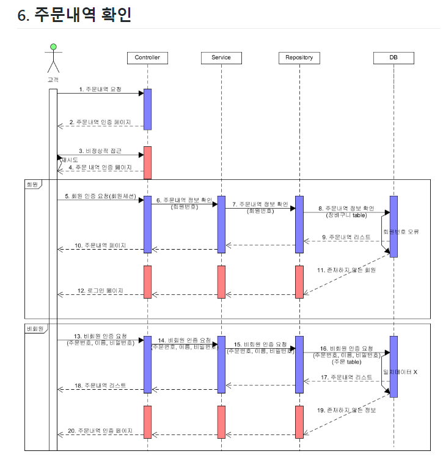


## db

> 옵션을 짜는게 복잡했는데 
>
> 실제로 프론트엔드와 함께 구현할때
>
> 시간이 없어 활용하지 모함

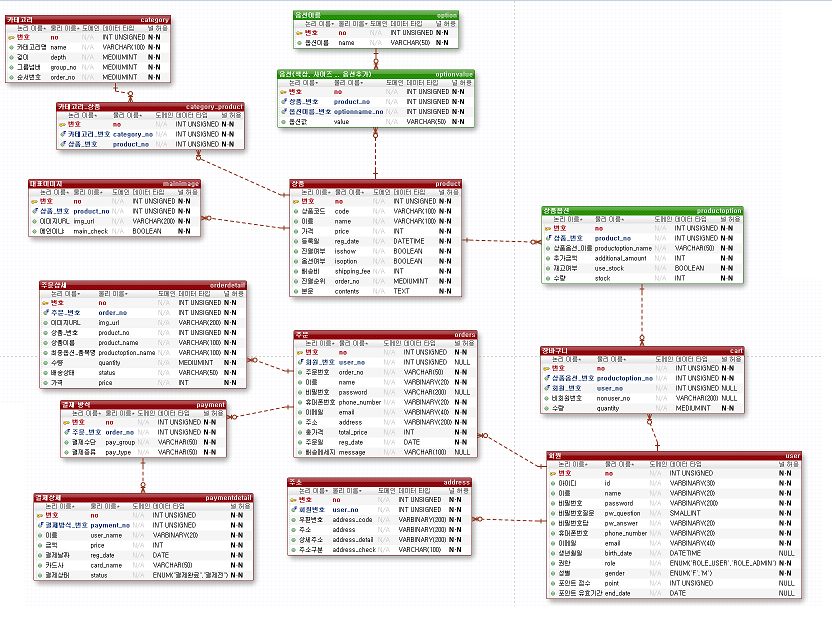


## Backend API 

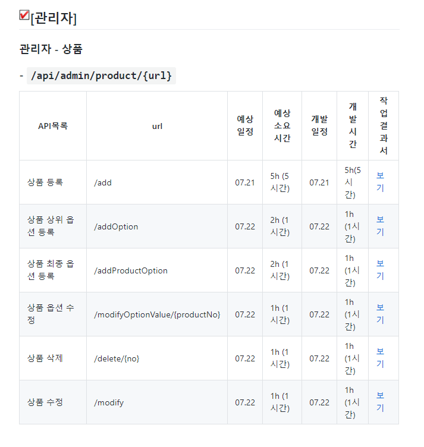

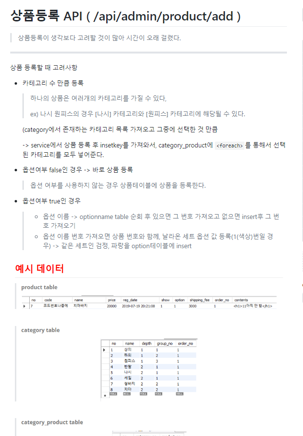


---

------

# TODO LIST

- **보안(Spring Security)과 인증(Oauth2) 적용하기**

  > - api를 집중해서 만들며 보안과 인증 절차를 적용하지 않았다.
  >
  > - 관리자의 경우 `/admin/**` url에 `ROLE_AMDIN` 권한을 적용해야 한다.
  >
  > - 비회원의 경우(**장바구니, 주문, 상품조회 등의 기능을 NonUserController에 몰아 넣었다.**) `/nonuser/**`url의 권한을 모두 허용해야한다.
  >
  >   > ex) `antMatch("/nonuser**").permitAll()`
  >
  >   > -> 효율적인 방법인지 깊게 고려해보지 못했지만, 비회원에게 모든 권한을 열어주기 위해서 비회원컨트롤러에 권한을 필요로하지 않는 기능을 몰아넣었다.
  >
  > - 그 외의 모든 url은 `ROLE_USER` 권한을 필요로 한다.

- **카테고리 테이블 수정하기** -> 확장성 고려 X

  > 현재 카테고리가 1개의 테이블로 구성이 되어있다.
  >
  > 하지만 카테고리 수정과 확장성을 고려 했을 때, 카테고리 테이블을 2개로 나누는 것이 좋을 것 같다.
  >
  > ex) 아래와 같은 형식으로 카테고리 테이블을 나누는 것이 좋을 것 같다.
  >
  > ```
  > CREATE TABLE category (
  >     category_no INTEGER NOT NULL,
  >     category_name VARCHAR(100) NOT NULL,
  >     CONSTRAINT pk_category PRIMARY KEY (category_no)
  > );
  > 
  > CREATE TABLE t_category_tree (
  >     tree_type CHAR(1) NOT NULL,
  >     category_no INTEGER NOT NULL,
  >     parent_category_no INTEGER NOT NULL,
  >     sort_no INTEGER NOT NULL,
  >     depth_no INTEGER NOT NULL,
  >     category_name_for_tree VARCHAR(100) NULL,
  >     CONSTRAINT pk_category_tree PRIMARY KEY (tree_type, category_no, parent_category_no)
  > );
  > ```

- mall_id 테이블 만들기

- 모든 컬럼에 mall_id 추가하기

  > 멀티 쇼핑몰 확장성을 고려해서 쇼핑몰을 구분할 수 있는 mall_id테이블을 만들고,
  >
  > 모든 테이블 컬럼에 mall_id를 추가하는 것이 좋을 것 같다.
  >
  > 아직 보안과 인증을 적용하지 않았지만 Security를 적용할 계획이기 때문에 mall_id를 추가해 client_id로 활용하는 것도 좋은 방법이라 생각한다.

- 이미지 업로드 (대표사진), Contents(HTML 편집기)

  > 아직 상품의 이미지를 넣는 기능을 하지 않았다. -> 프론트엔드와 함께 다시 구현할 예정

- user table role 수정 => ROLE_USER, ROLE_ADMIN

  > 현재 table에 데이터가 `enum('U', 'A')` 형식으로 들어간다.
  >
  > 이를 씨큐리티 적용을 고려하여 `enum('ROLE_USER', 'ROLE_ADMIN')` 로 수정해야한다.

- db예외처리 -> 트랜잭션으로 처리하기

- Valid Check

- tdd사용 미숙

------

------

# 개선사항

- **비회원 컨트롤러 -> 비회원 기능 나누기**

  > 나중에 시큐리티 적용하고 `antMatch("/nonuser**").permitAll()` 이런식으로 나누기위해, 기존에 기능별로(장바구니 -CartController, 주문-OrderController 등..) 나누었던 URL을, 로그인하지 않아도 사용할 수 있도록 `NonUserController`로 넣었다.

- **상품 등록, 옵션 등록 합치기**

  > 원래 상품 등록을 View에서 버튼을 누를 때 마다 ajax통신으로 하나씩 해결할 생각이였다.
  >
  > 하지만, 상품 등록을 누른 순간 `/product/add` url로 한번만 통신을 하여 Service단에서 한번에 받은 데이터들을 처리했다.

- **주문시 재고 확인, 결제됐는지 확인 -> 어떤 제품이 재고가 없는지 확인** && 트랜젝션 고려하기

  > 주문 시 재고를 고려하지않고 바로 주문 테이블에 insert를 했었다.
  >
  > 주문 시 재고를 체크하는 옵션인지 고려한 뒤, 재고를 체크해야하는 경우 주문 재고보다 장바구니 재고가 더 많은지 확인한다.
  >
  > 고려 해야 할 것 : 여러 사람이 동시에 주문할 경우 트랜잭션을 어떻게 처리해야할지 고려해보아야한다.
  >
  > -> 생각한 방안 : 주문을하는 경우 해당 url의 서비스 로직에 LOCK을 걸어 첫번째 사용자가 결제완료가 되기까지 다른 사용자가 주문할 수 없도록 한다.

- ~~**주문시 장바구니 비우기**~~

- **발리데이션 추가하기 ( 커스텀 )**

- 파라미터 수정

  > 일관성 없는 형식으로 파라미터를 마구잡이로 받았었는데, 이를 나름 일관성 있게 수정하였다.

- 이미지, 파일업로더 서버 분리 필요
- 접근제한(요청수 제한)

---

## 개발하면서 생각했던 것

문제점

- 사용자가 입력하는 값에 대하여 유효성을 검증하기 위해 Vo 객체에 대해 Valid 어노테이션을 사용
- 기존에 있던 Email, NotEmpty 등의 지원되는 어노테이션이 아닌 핸드폰 형식, 날짜 형식 등의 검증을 수행하기 위한 어노테이션이 필요
- Pattern 어노테이션을 사용할시 정규표현식과 메세지가 Vo 객체에서 너무 길게 나오기 때문에 지저분해짐
- 즉, 이를 해결하기 위해 커스텀 어노테이션을 생성

문제점

- MyBatis에서 1:N 관계에 있는 다수의 테이블을 join 후 객체에 넣는 방법이 필요
- Mybatis에서 1:N 관계에 있는 테이블을 join을 이용해 클래스에 맵핑하는 방법 습득
- Mybatis의 Mapper.xml에서 resultMap을 사용하며, 쿼리 태그에서도 resultMap을 사용
- resultMap에서 설정한 id를 바탕으로 select 태그의 resultMap 부분을 해당 id로 설정

깨달은 점

- 상품 정보를 수정할 때 해당 상품의 옵션을 변경하거나 삭제하는 경우 옵션과 주문이 연결되어 있으면 문제가 발생
- 사용자 입장에서는 주문했을 당시의 해당 상품의 옵션 정보를 갖고 있어야 하는데 상품과 주문을 연결시켜 놓으면 상품의 옵션을 변경 혹은 삭제시 상품 주문에서의 옵션 또한 변경됨
- 이를 해결하기 위해 상품과 주문의 연결을 끊고, 주문 쪽에 옵션 값을 추가하여 현재 상품이 갖고 있는 옵션과 주문했을 당시의 옵션 사이의 무결성을 일부러 깨뜨리도록 함
- ERD 관계를 설계할 때 데이터의 삽입 부분만 생각하는 것이 아니라 1:N 관계의 테이블에서 부모 테이블이 수정 혹은 삭제될 때 연결되어 있는 자식 테이블을 어떻게 할지를 생각해야 된다는 것을 깨달음
- 예를 들어 부모 테이블을 수정, 삭제할 때 자식 테이블도 함께 수정, 삭제 하는 단순한 경우는 cascade를 사용하면 되지만
- 부모 테이블이 삭제 되더라도 자식 테이블이 값을 유지하도록 해야하면 자식 테이블에서 부모 테이블의 컬럼중 유지할 컬럼을 몇 개 갖고 있도록 하는 것이 맞는 방법인것 같음

암호화

- 평문의 비밀번호는 해시함수(해시 알고리즘)를 이용하여 고정된 길이의 암호화된 문자열로 바꾸는 방법을 사용했습니다. 여러 방법 중 보안이 뛰어난 SHA 512을 사용해 db에 데이터를 넣을때 직접 적용했습니다. 복호화가 불가능한 단방향 암호화 기법이기 때문에 사용자가 비밀번호를 찾고 싶을시에는 임시 비밀번호를 이메일을 통해 전송해주는 방식을 사용할 예정입니다. (Gmail SMTP)

- 비밀번호를 제외한 나머지 데이터들은 사용자에게 제공해야 하기 때문에 양방향 암호화 방법인 AES를 사용하였습니다. 암호화한 데이터를 다시 복호화하기 위하여 별도의 key가 필요한데 이 key값으로는 SHA2 함수를 사용해서 지정해주는 것이 더 안전합니다. 이 부분을 고려하여 key값을 수정할 예정입니다. 
  db에서 제공하는 암호화 함수들은 임의의 byte 값을 반환하기 때문에 단순히 string을 저장하는 text나 varchar 같은 경우 에러가 발생합니다. 이를 방지하지 위해서 암호화 컬럼은 byte string을 가지는 VARBINARY로 지정하였습니다.

상품 등록

- 상품 등록할 때 많은 정보를(이미지, 옵션, 옵션디테일 등) 한번에 등록해야 했습니다. 이 부분을 각각의 api를 만들어 나눌지 한번에 등록할지 고민을 많이 했었습니다. 여러 개의 api로 나누면 관리자가 등록할 때 호출이 여러 번 일어나 성능 관점에서 문제가 생기고 다양한 예외 케이스들이 발생해 개발 비용이 늘어나는 점을 고려해 한번에 등록하기로 결정하였습니다.
- 1:n으로 엮여있는 구조가 많은 관계로 list를 반복적인 SQL구문을 통해 삽입,업데이트 등을 할 경우가 많이 생겼습니다. 처음에는 Service단에서 for문을 사용해 List형태의 객체를 반복해서 단일 처리를 하는 방법으로 개발하였습니다. 이 방법은 코드상으로도 sqlSession을 계속 호출하게 되어 좋지 않다고 생각이 들어습니다. 이를 mybatis foreach collection을 통해 한번의 sqlSession 호출로 반복 처리를 해결하였습니다.

상품 삭제 

- 그때 DB 수업 받을 때 회원 컬럼에 상태(휴먼, 활성화, 탈퇴)등의 데이터가 있어서 탈퇴한 회원은 연결된 계정이 많아서 정말 삭제하는 것이 아니라 컬럼 상태를 변경한다고해서 그렇게

TDD

- 일단 TDD를 프로젝트에 적용해 진행해 본 것은 처음이였기 때문에 적용기간이 필요했습니다. 하지만 한번 적응해서 써보니 확실히 디버깅 시간이 줄면서 잔 에러들의 오류를 금방 찾을 수 있었습니다. 또한 생각치 못한 부분에서 fail의 결과물인 빨간 막대를 볼때는 내가 고려하지 못한 부분을 TDD를 통해서 도움을 받고 있다는 생각에 안심이 되기도 했습니다. 이러한 이점은 TDD를 단순히 산출물로만 보지 않게 되었던 이유가 되었습니다. 기본적으로 테스트를 먼저 다 만들고 개발했지만 중간에 간단한 기능들은 개발을 먼저 진행하고 테스트 코드를 작용해 검증하는 형태로 진행하기도 했습니다. 카페24에 입사해서는 철저하게 적성 TDD 방식대로 적용하는 습관을 길러 로직변경에 두려움을 가지지 않는 개발을 진행할 예정입니다.


---

## api 목록 작성

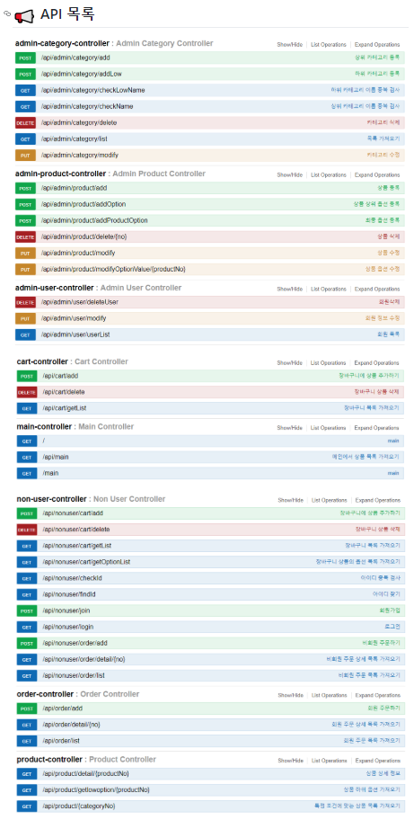

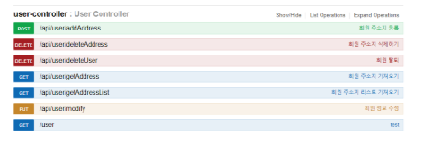

## 마지막 결과물

동영상


## 회고

이런게 아쉬웠다.

이런걸 배워서 좋았따.


