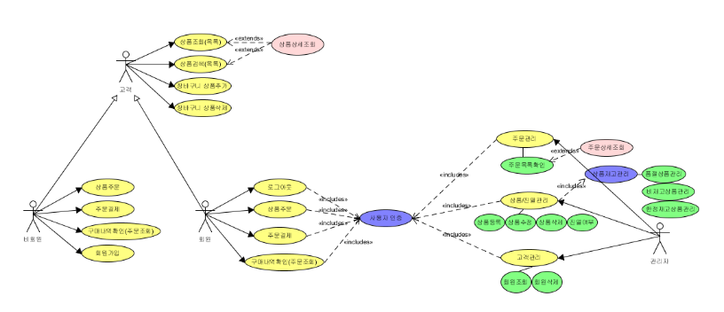
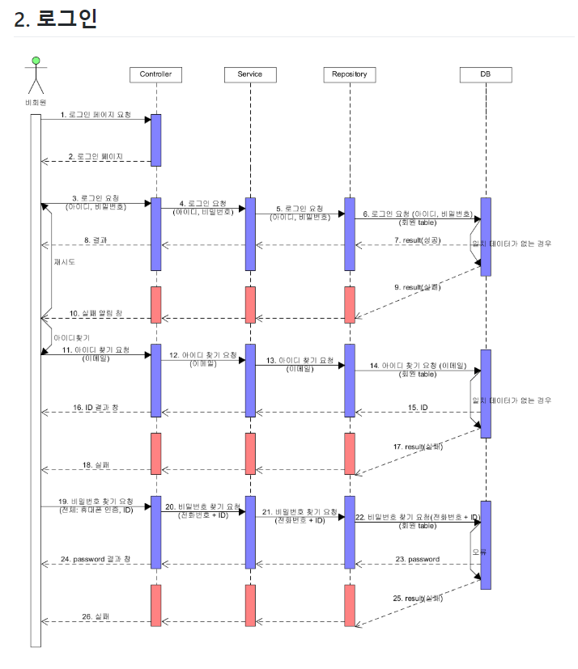
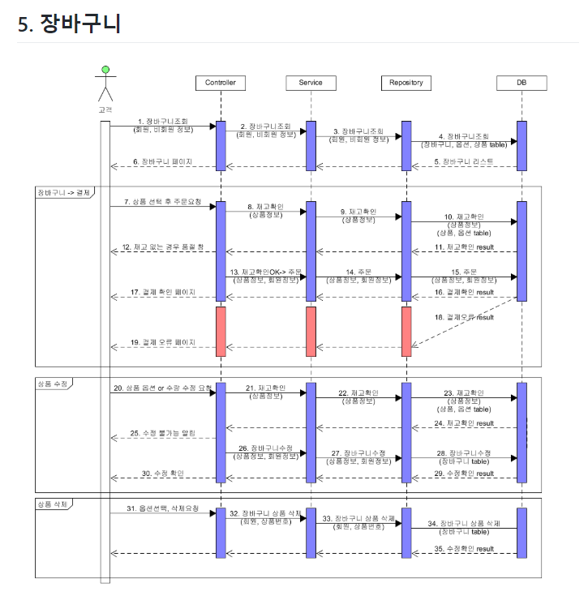
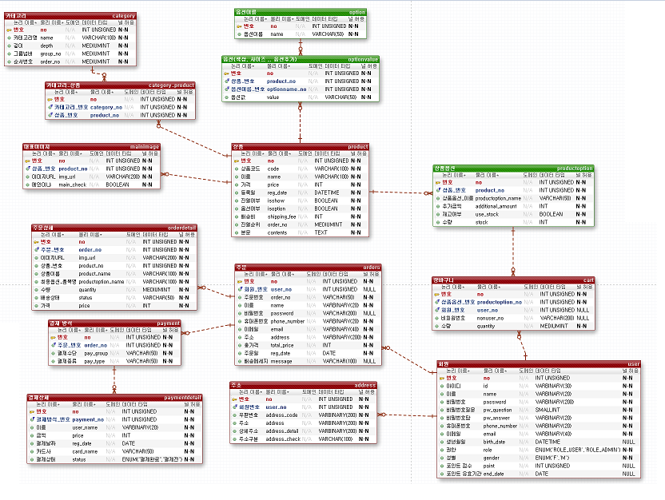
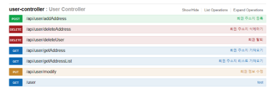

[TOC]

시연은 동영상으로 하고 PPT로 발표

- 설계 및 분석
- 수행일정 + 고민
- 결과물
- 시연 모습 + 회고

---

설계 

## 초반 :

### usecase

초반 설계는 그냥 usecase로 어떤 기능을 넣을 것인지 먼저 대강 짜고




### storyboard

사용자 스토리보드를 통해 기능 정리함과 동시에 나중에 프론트엔드에 넣을 기능들도 미리 만들었다.

처음 써봤는데 나중에 개발할때 큰 도움이 됐었어서 추천. 


### 시퀀스








## db

> 옵션을 짜는게 복잡했는데 
>
> 실제로 프론트엔드와 함께 구현할때
>
> 시간이 없어 활용하지 모함




## Backend API 


---

------

# TODO LIST

- **보안(Spring Security)과 인증(Oauth2) 적용하기**

  > - api를 집중해서 만들며 보안과 인증 절차를 적용하지 않았다.
  >
  > - 관리자의 경우 `/admin/**` url에 `ROLE_AMDIN` 권한을 적용해야 한다.
  >
  > - 비회원의 경우(**장바구니, 주문, 상품조회 등의 기능을 NonUserController에 몰아 넣었다.**) `/nonuser/**`url의 권한을 모두 허용해야한다.
  >
  >   > ex) `antMatch("/nonuser**").permitAll()`
  >
  >   > -> 효율적인 방법인지 깊게 고려해보지 못했지만, 비회원에게 모든 권한을 열어주기 위해서 비회원컨트롤러에 권한을 필요로하지 않는 기능을 몰아넣었다.
  >
  > - 그 외의 모든 url은 `ROLE_USER` 권한을 필요로 한다.

- **카테고리 테이블 수정하기**

  > 현재 카테고리가 1개의 테이블로 구성이 되어있다.
  >
  > 하지만 카테고리 수정과 확장성을 고려 했을 때, 카테고리 테이블을 2개로 나누는 것이 좋을 것 같다.
  >
  > ex) 아래와 같은 형식으로 카테고리 테이블을 나누는 것이 좋을 것 같다.
  >
  > ```
  > CREATE TABLE category (
  >     category_no INTEGER NOT NULL,
  >     category_name VARCHAR(100) NOT NULL
  >     CONSTRAINT pk_category PRIMARY KEY (category_no)
  > );
  > 
  > CREATE TABLE t_category_tree (
  >     tree_type CHAR(1) NOT NULL,
  >     category_no INTEGER NOT NULL,
  >     parent_category_no INTEGER NOT NULL,
  >     sort_no INTEGER NOT NULL,
  >     depth_no INTEGER NOT NULL,
  >     category_name_for_tree VARCHAR(100) NULL,
  >     CONSTRAINT pk_category_tree PRIMARY KEY (tree_type, category_no, parent_category_no)
  > );
  > ```

- mall_id 테이블 만들기

- 모든 컬럼에 mall_id 추가하기

  > 멀티 쇼핑몰 확장성을 고려해서 쇼핑몰을 구분할 수 있는 mall_id테이블을 만들고,
  >
  > 모든 테이블 컬럼에 mall_id를 추가하는 것이 좋을 것 같다.
  >
  > 아직 보안과 인증을 적용하지 않았지만 Security를 적용할 계획이기 때문에 mall_id를 추가해 client_id로 활용하는 것도 좋은 방법이라 생각한다.

- 이미지 업로드 (대표사진), Contents(HTML 편집기)

  > 아직 상품의 이미지를 넣는 기능을 하지 않았다. -> 프론트엔드와 함께 다시 구현할 예정

- user table role 수정 => ROLE_USER, ROLE_ADMIN

  > 현재 table에 데이터가 `enum('U', 'A')` 형식으로 들어간다.
  >
  > 이를 씨큐리티 적용을 고려하여 `enum('ROLE_USER', 'ROLE_ADMIN')` 로 수정해야한다.

- db예외처리 -> 트랜잭션으로 처리하기

- Valid Check

------

------

# 개선사항

- **비회원 컨트롤러 -> 비회원 기능 나누기**

  > 나중에 시큐리티 적용하고 `antMatch("/nonuser**").permitAll()` 이런식으로 나누기위해, 기존에 기능별로(장바구니 -CartController, 주문-OrderController 등..) 나누었던 URL을, 로그인하지 않아도 사용할 수 있도록 `NonUserController`로 넣었다.

- **상품 등록, 옵션 등록 합치기**

  > 원래 상품 등록을 View에서 버튼을 누를 때 마다 ajax통신으로 하나씩 해결할 생각이였다.
  >
  > 하지만, 상품 등록을 누른 순간 `/product/add` url로 한번만 통신을 하여 Service단에서 한번에 받은 데이터들을 처리했다.

- **주문시 재고 확인, 결제됐는지 확인 -> 어떤 제품이 재고가 없는지 확인** && 트랜젝션 고려하기

  > 주문 시 재고를 고려하지않고 바로 주문 테이블에 insert를 했었다.
  >
  > 주문 시 재고를 체크하는 옵션인지 고려한 뒤, 재고를 체크해야하는 경우 주문 재고보다 장바구니 재고가 더 많은지 확인한다.
  >
  > 고려 해야 할 것 : 여러 사람이 동시에 주문할 경우 트랜잭션을 어떻게 처리해야할지 고려해보아야한다.
  >
  > -> 생각한 방안 : 주문을하는 경우 해당 url의 서비스 로직에 LOCK을 걸어 첫번째 사용자가 결제완료가 되기까지 다른 사용자가 주문할 수 없도록 한다.

- ~~**주문시 장바구니 비우기**~~

- **발리데이션 추가하기 ( 커스텀 )**

- 파라미터 수정

  > 일관성 없는 형식으로 파라미터를 마구잡이로 받았었는데, 이를 나름 일관성 있게 수정하였다.


## api 목록 작성




## 마지막 결과물

동영상


## 회고

이런게 아쉬웠다.

이런걸 배워서 좋았따.


